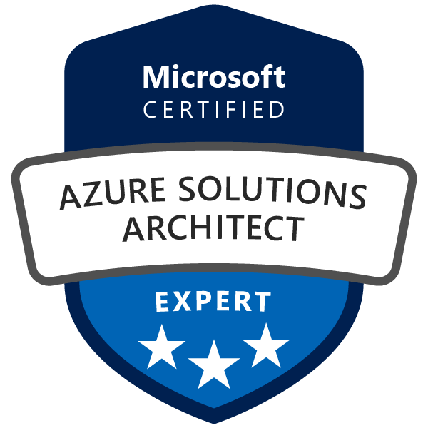

# Microsoft Azure Solutions Architect Expert: `From Zero to Cloud Hero`

  
  

## Course Description:

"Embark on a transformative journey into the world of cloud computing with our comprehensive Azure Solutions Architect Expert: From Zero to Cloud Hero course. Designed specifically for individuals with no prior cloud knowledge, this 60-day intensive program provides a deep dive into Microsoft Azure, guiding you from fundamental concepts to advanced architectural design and daily operational tasks.

Through recorded video lectures and offline resources, you will gain hands-on experience with Azure's core services, including networking, compute, storage, databases, identity management, security, monitoring, automation, and DevOps. 

This course emphasizes practical application, preparing you not just for the Microsoft Azure Certified Solutions Expert certifications (such as AZ-104 and AZ-305), but also for real-world scenarios in a professional cloud environment. 

By the end of this program, you will be equipped with the skills and confidence to design, implement, and manage robust, scalable, and secure solutions on Microsoft Azure."

## What Students Will Learn (Learning Outcomes):

Upon successful completion of this 45-day intensive course, participants will be able to:

**Design robust Identity, Governance, and Monitoring solutions:**

* Implement comprehensive strategies for enterprise-grade identity management (Azure AD/Entra ID), sophisticated access control (RBAC, PIM, Conditional Access), organizational governance (Azure Policy, Blueprints, Management Groups), and holistic monitoring (Azure Monitor, Log Analytics, Application Insights) with advanced alerting.

**Architect resilient and performant Data Storage Solutions:**

* Design optimal solutions for relational, non-relational, data warehousing, and big data storage, considering performance, scalability, cost, security, advanced encryption, and data protection strategies (Azure SQL, Cosmos DB, Blob Storage, Data Lake Storage, Synapse Analytics, Purview).

**Develop comprehensive Business Continuity, Disaster Recovery, and High Availability plans:**

* Design highly available and fault-tolerant solutions across regions, implement robust backup and recovery strategies (Azure Backup, Azure Site Recovery) with detailed RTO/RPO analysis, and engineer for maximum uptime.

**Design scalable, secure, and optimized Infrastructure Solutions:**

* Architect diverse compute solutions (VMs, VM Scale Sets, AKS, App Service, Functions, Logic Apps), design secure and efficient network topologies (VNets, VPN Gateway, ExpressRoute, Load Balancers, Application Gateway, Firewall, Front Door, Private Link, DDoS Protection), and plan for effective workload migrations and modernization.

**Apply the Azure Well-Architected Framework holistically:**

* Integrate principles of cost optimization, operational excellence, performance efficiency, reliability, and security into all architectural designs, demonstrating best practices for sustainable cloud solutions.

**Translate complex business requirements into technical solutions:**

* Advise stakeholders, analyze intricate requirements, and design solutions that precisely meet business needs, technical constraints, and compliance mandates.

**Master common architectural patterns and anti-patterns:**

* Understand and apply proven cloud design patterns to solve common challenges and identify design flaws.

**Prepare confidently and comprehensively for the AZ-305 exam:**

* Gain the necessary in-depth knowledge and extensive practical experience to successfully pass the Microsoft Certified: Azure Solutions Architect Expert exam.

## Who Will Benefit:

This course is ideally suited for:

**Experienced IT Professionals:**

* System Administrators, Network Engineers, Developers, and Database Administrators with significant experience who are ready to transition into and lead cloud architecture roles.

**Current Azure Administrators:**

* Individuals holding the Azure Administrator Associate (AZ-104) certification who want to significantly deepen their design expertise and strategic thinking.

**Cloud Architects:**

* Professionals already working with cloud platforms (e.g., AWS, GCP) who wish to specialize in Microsoft Azure's advanced architectural capabilities.

**Technical Consultants:**

* Individuals advising enterprise clients on complex cloud strategy, migration, and solution design.

**Solution Designers and Technical Leads:**

* Responsible for leading the design and implementation of cloud solutions within their organizations.

**Anyone aspiring to achieve the Microsoft Certified:**

* Azure Solutions Architect Expert certification and build a career as a leading cloud architect.

## Section 1: ☁️ Cloud Computing & Azure Fundamentals:

This section introduces the core concepts of cloud computing and the foundational services within Microsoft Azure, setting the stage for deeper dives into specific service categories.

* Day 1: Introduction to Cloud Computing.

    * What is Cloud Computing? (IaaS, PaaS, SaaS)
    * Benefits of Cloud Computing (Scalability, Agility, Cost-effectiveness)
    * Public, Private and Hybrid Clouds
    * Introduction to Microsoft Azure

* Day 2: Getting Started with Azure:

    * Creating an Azure Account and Subscription
    * Overview of the Azure Portal
    * Understanding Azure Regions and Availability Zones
    * Azure Resource Groups and Resources

* Day 3: Azure Management Tools:

    * Azure Portal Navigation and Customization
    * Introduction to Azure Cloud Shell (Bash & PowerShell)
    * Azure CLI (Command Line Interface) basics
    * Azure PowerShell basics

## Section 2: 🌐 Azure Networking & Connectivity

This section focuses on Azure's robust networking capabilities, from virtual networks and subnets to advanced connectivity options and traffic management.

* Day 4: Azure Networking - Virtual Networks (VNets) Part 1:

    * Introduction to Azure Virtual Networks
    * IP addressing (Public vs Private IPs)
    * Subnets and CIDR Notation
    * Creating a VNet and Subnets

* Day 5: Azure Networking - Virtual Networks(VNets) Part 2:

    * Network Security Groups(NSGs) - Inbound and Outbound Rules
    * Associating NSGs with Subnets and NICs
    * Understanding Default NSG Rules
    * Troubleshooting Network Connectivity with NSGs

* Day 6: Azure DNS & Load Balancing Fundamentals:

    * Introduction to Azure DNS
    * Creating DNS Zones and Records (A, CNMAE, MX, TXT)
    * Introduction to Azure Load Balancer (Basic vs Standard)
    * Configuring a Simple Load Balancer

* Day 7: VNet Peering & Service Endpoints:

    * Connecting VNets with VNet Peering
    * Use Cases and Limitations of VNet Peering
    * Introduction to Azure Service Endpoints
    * Securing access to Azure Services via Service Endpoints

* Day 8: Azure VPN Gateway:

    * Introduction to VPN Gateway (Site-to-Site, Point-to-Site)
    * Creating a Site-to-Site VPN connection (conceptual and configuration steps)
    * Understanding VPN Gateway SKUs

* Day 9: Azure ExpressRoute:

    * Introduction to ExpressRoute for dedicated private connectivity.
    * Benefits and use cases of ExpressRoute
    * ExpressRoute connectivity models
    * When to choose ExpressRoute over VPN Gateway.

* Day 10: Azure DNS Private Zones & Traffic Manager:

    * Implementing Azure DNS Private Zones for VNet resolution
    * Introduction to Azure Traffic Manager (DNS-Based load Balancing)
    * Traffic Manager Routing Methods (Priority, Weighted, Performance and Geographic)

* Day 11: Azure Front Door & Azure Application Gateway:

    * Introduction to Azure Front Door (Global, Scalable entry-point)
    * Introduction to Azure Application Gateway (Web Application Firewall - WAF):
    * Key Differences and Use Cases for each

* Day 12: Azure Network Watcher:

    * Troubleshooting network connectivity issues
    * IP flow verify, NSG flow logs, Connection Monitor
    * Diagnosing common network problems.

## Section 3: 💻 Azure Compute & Application Hosting:

This section covers the various compute options in Azure, from virtual machines to serverless functions and containerization, along with hosting web applications.

* Day 13: Core Azure Compute Services - Virtual Machines(VMs) Part 1:

    * Introduction to Azure Virtual Machines
    * VM Sizes, Series and Pricing
    * Creating a Windows VM in the Azure Portal
    * Connecting to a Windows VM(RDP)

* Day 14: Core Azure Compute Services - Virtual Machines (VMs) Part 2:

    * Creating a Linux VM in the Azure Portal
    * Connecting to a Linux VM (SSH)
    * Managing VM States (Start, Stop, Restart, Deallocate)
    * Understanding VM Disks (OS Disks, Data Disks)

* Day 15: VM Scalaibility & Availability:

    * Availability Sets ( Faults Domains, Update Domains)
    * Availability Zones for High Availability
    * Introduction to Virtual Machine Scale Sets (VMSS)
    * Configuring Auto-Scaling for VMSS

* Day 16: Azure App Service - Web Apps:

    * Introduction to Azure App Service
    * App Service Plans (Pricing Tiers)
    * Deploying a Web App from GitHub/Local Git
    Configuring Custom Domains and SSL Certificates

* Day 17: Azure App Service - Deployment Slots & Monitoring:

    * Understanding Deployment Slots for Zero-downtime deployments
    * Swapping Deployment Slots
    * Monitoring App Service Performance (Metrics, Logs)
    * Troubleshooting common App Service Issues

* Day 18: Azure Container Instances (ACI) & introduction to Docker:

    * What are Containers? Introduction to Docker
    * Benefits of Containerization
    * Deploying a simple container to Azure Container Instances
    * Managing ACI Instances

* Day 19:

    * What is Kubernetes?
    * Overview of AKS Architecture (Control Plane, Worker Nodes)
    * When to use AKS vs ACI

* Day 20: Azure Functions - Serverless Compute:

    * Introduction to Serverless Computing
    * What are Azure Functions? Triggers and Bindings
    * Creating a Simple HTTP-triggered Function
    * Integrating Functions with other Azure Services.

## Section 4: 💾 Azure Storage Solutions:

This section delves into Azure's various storage options, from basic blob storage to file shares, tables, and queues.

* Day 21: Azure Storage Accounts - Basics:

    * Introduction to Azure Storage Accounts
    * Storage Account Types (Standard, Premium) and Replication (LRS, GRS, RA-GRS, ZRS)
    * Blob Storage (Block, Page, Append Blobs)
    * Creating a Storage Account and uploading Blobs

* Day 22: Azure Storage Accounts - Advanced:

    * Azure File Shares (SMB)
    * Azure Table Storage (NoSQL)
    * Azure Queue Storage (Message Queues)
    * Shared Access Signatures (SAS) for secure access

* Section 5: 🗄️ Azure Database Services:

This section explores Azure's comprehensive suite of database services, including relational, NoSQL, and caching solutions.

* Day 23: Azure SQL Database - Basics:

    * Introduction to Azure SQL Database
    * Deployment Models (Single Database, Elastic Pool, Managed Instance)
    * Creating an Azure SQL Database
    * Connecting to SQL DB from SSMS/Azure Data Studio

* Day 24: Azure SQL Database - Advanced & Security:

    * Scaling Azure SQL Database (DTUs/vCores)
    * Backup and Restore options
    * SQL Database Firewall Rules
    * Transparent Data Encryption (TDE)

* Day 25: Azure Cosmos DB - NoSQL Database:

    * Introduction to Azure Cosmos DB (Globally distributed, multi-model)
    * Core Concepts (APIs: SQL, MongoDB, Cassandra, Gremlin, Table)
    * Creating a Cosmos DB account and a SQL API database
    * Understanding Request Units (RUs)

* Day 26: Azure Database for MySQL/PostgreSQL:

    * Introduction to Azure Database for MySQL
    * Introduction to Azure Database for PostgreSQL
    * Creating and connecting to a flexible server instance
    * Key features and use cases

* Day 27: Azure Cache for Redis & Data Migration:

    * Introduction to Azure Cache for Redis
    * Use cases for caching
    * Basic concepts of data migration to Azure Databases
    * Overview of Azure Database Migration Service

## Section 6: 🔑 Azure Identity & Access Management:

This section focuses on managing identities and controlling access to Azure resources, a critical aspect of cloud security.

* Day 28: Azure Active Directory (Azure AD) Fundamentals:

    * What is Azure AD? (Identity and Access Management)
    * Azure AD vs. Windows Server AD
    * Azure AD Tenants and Directories
    * Managing Users and Groups in Azure AD

* Day 29: Azure AD Connect & Hybrid Identity:

    * Introduction to Azure AD Connect for synchronizing on-premises AD
    * Understanding Hybrid Identity scenarios
    * Password Hash Synchronization, Pass-through Authentication, Federation

* Day 30: Role-Based Access Control (RBAC):

    * Understanding RBAC concepts (Role, Scope, Assignment)
    * Built-in Azure Roles
    * Assigning RBAC roles to users/groups
    * Best practices for RBAC

* Day 31: Azure AD Multi-Factor Authentication (MFA):

    * Importance of MFA for security
    * Enabling MFA for users
    * MFA methods (Authenticator App, SMS, Call)
    * Conditional Access Policies (Introduction)

* Day 32: Azure AD Identity Protection & PIM (Conceptual):

    * Introduction to Azure AD Identity Protection (Risk detection, Remediation)
    * Privileged Identity Management (PIM) for just-in-time access
    * Managing Service Principals and Managed Identities

## Section 7: 🛡️ Azure Security, Governance & Compliance:

This section covers broader security practices, policy enforcement, resource management, and cost optimization within Azure.

* Day 33: Azure Security Center / Defender for Cloud:

    * Introduction to Azure Security Center (Cloud Security Posture Management, Cloud Workload Protection)
    * Secure Score and Recommendations
    * Monitoring security alerts

* Day 34: Azure Key Vault:

    * Storing secrets, keys, and certificates securely
    * Creating a Key Vault and storing secrets
    * Integrating Key Vault with Azure applications

* Day 35: Azure Policy:

    * Enforcing organizational standards and compliance
    * Creating and assigning Azure Policies (Built-in and Custom)
    * Understanding Policy Definitions, Initiatives, and Assignments

* Day 36: Azure Blueprints (Conceptual) & Resource Locks:

    * Introduction to Azure Blueprints for repeatable environments
    * Implementing Resource Locks (Delete, Read-Only)
    * Protecting critical resources from accidental deletion/modification

* Day 37: Azure Cost Management + Billing

    * Understanding Azure Billing and Subscriptions
    * Monitoring and analyzing Azure costs
    * Setting up budgets and cost alerts
    * Cost optimization strategies

* Section 8: 📊 Azure Monitoring, Automation & Operations

This section focuses on how to monitor Azure resources, automate tasks, and manage infrastructure as code for efficient operations.

* Day 38: Azure Monitor - Overview

    * Introduction to Azure Monitor (Collecting, Analyzing, Acting on telemetry)
    * Metrics and Logs
    * Monitoring Dashboards

* Day 39: Azure Monitor - Log Analytics Workspaces

    * Collecting logs from various Azure resources
    * Introduction to Kusto Query Language (KQL)
    * Writing basic KQL queries for troubleshooting

* Day 40: Azure Monitor - Alerts & Action Groups

    *Creating Metric Alerts and Log Alerts
    * Configuring Action Groups (Email, SMS, Webhooks, ITSM)
    * Automating responses to alerts

* Day 41: Troubleshooting Azure Resources

    * Using Azure Resource Health
    * Activity Log for auditing and troubleshooting
    * Common troubleshooting steps for VMs, Web Apps, and Databases

* Day 42: Azure Automation - Runbooks

    *Introduction to Azure Automation
    * Creating PowerShell and Python Runbooks
    * Scheduling and executing Runbooks

* Day 43: Azure Automation - Desired State Configuration (DSC)

    * Managing configuration of VMs with DSC
    * Onboarding VMs to DSC
    * Creating and deploying DSC configurations

* Day 44: Introduction to Infrastructure as Code (IaC)

    * What is IaC? Benefits of IaC
    * Overview of ARM Templates (Azure Resource Manager)
    * Understanding ARM Template structure (Parameters, Variables, Resources, Outputs)

* Day 45: Deploying Resources with ARM Templates

    * Creating a simple ARM Template (e.g., for a Storage Account)
    * Deploying ARM Templates via Azure Portal, CLI, PowerShell
    * Using ARM Template parameters

* Day 46: Introduction to Bicep (Microsoft's DSL for IaC)

    * Why Bicep? (Simpler syntax than ARM Templates)
    * Converting ARM Templates to Bicep
    * Deploying resources with Bicep

## Section 9: 🧠 Azure Data, Analytics & AI/ML:

This section introduces students to Azure's capabilities for handling large datasets, performing analytics, and leveraging artificial intelligence and machine learning services.

* Day 47: Azure Data Lake Storage & Azure Synapse Analytics (Conceptual)

    *Introduction to Data Lake Storage Gen2
    * Overview of Azure Synapse Analytics (Data warehousing, Big Data analytics)
    * When to use Data Lake vs. Blob Storage

* Day 48: Introduction to Azure Databricks (Conceptual)

    * What is Databricks? (Apache Spark-based analytics platform)
    * Use cases for big data processing and machine learning
    * (Conceptual) Running a simple notebook

* Day 49: Introduction to Azure AI/ML Services (Conceptual)

    * Overview of Azure Machine Learning Studio
    * Cognitive Services (Vision, Speech, Language, Decision, Search)
    * Use cases for integrating AI into applications

## Section 10: 🔗 Azure Integration, Messaging & DevOps:

This final section covers how Azure services can be integrated, messaging patterns, the principles of DevOps, and concludes with exam preparation.

* Day 50: Azure Logic Apps - Workflow Automation

    * Introduction to Logic Apps (Visual workflow designer)
    * Creating a simple Logic App for automation
    * Connectors and Actions

* Day 51: Azure Event Grid & Event Hubs

    * Introduction to Event Grid (Event routing service)
    * Introduction to Event Hubs (Big data streaming platform)
    * Use cases for event-driven architectures

* Day 52: Azure Service Bus - Enterprise Messaging

    * Introduction to Service Bus (Queues, Topics, Subscriptions)
    * When to use Service Bus vs. Event Hubs vs. Storage Queues
    * Implementing a simple Service Bus Queue

* Day 53: Azure API Management (Conceptual)

    * Introduction to API Management (Publish, secure, transform, monitor APIs)
    * Key features and benefits
    * Use cases for API Management

* Day 54: Introduction to Azure DevOps

    * Overview of Azure DevOps services (Boards, Repos, Pipelines, Test Plans, Artifacts)
    * Creating an Azure DevOps organization and project
    * Version Control with Azure Repos (Git)

* Day 55: Azure Pipelines - CI/CD for Applications

    * Introduction to Continuous Integration (CI)
    * Introduction to Continuous Delivery/Deployment (CD)
    * Creating a simple Build Pipeline (CI) for a web application

* Day 56: Azure Pipelines - Release Management

    * Creating a simple Release Pipeline (CD)
    * Deploying applications to Azure App Service using Pipelines
    * Understanding Stages, Jobs, and Tasks

* Day 57: Azure DevOps - Boards & Artifacts

    * Managing work items with Azure Boards (Scrum, Agile, CMMI)
    * Tracking progress and creating dashboards
    * Introduction to Azure Artifacts (Package management)

* Day 58: Monitoring DevOps Deployments & Best Practices

    * Integrating Azure Monitor with Azure DevOps
    * Best practices for CI/CD pipelines
    * Security considerations in DevOps

* Day 59: Course Review & Key Concepts Recap

    * Revisiting critical Azure services (VMs, VNets, Storage, AD, App Service)
    * Q&A session on challenging topics
    * Review of daily operational tasks

* Day 60: Certification Exam Preparation & Next Steps

    * Overview of the Azure Solutions Expert certification paths (e.g., AZ-104, AZ-305)
    * Exam registration process and tips
    * Practice exam strategies and resources
    * Career paths in Azure and continuous learning