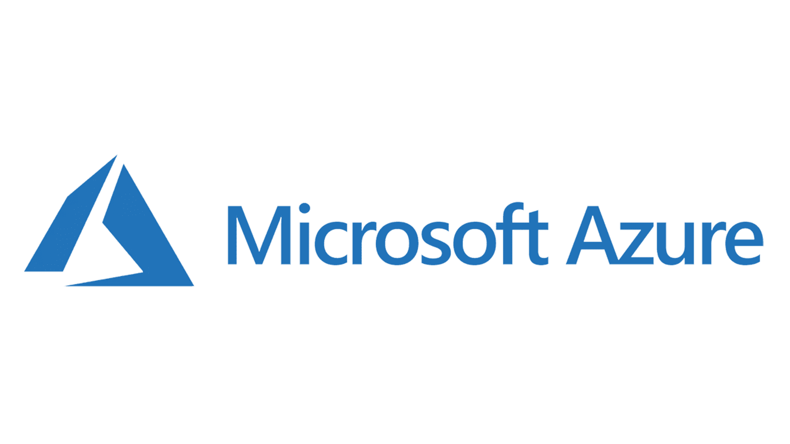
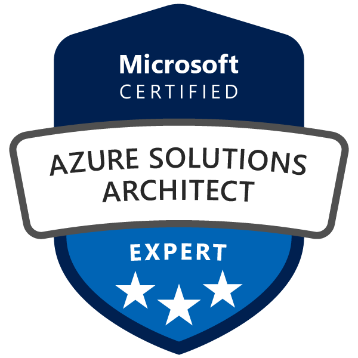

# 🚀 Azure Solutions Architect Expert Journey:

<div align="left">
  
  
</div>

This repository is dedicated to guiding aspiring Azure Solutions Architects through a structured learning path, preparing them for the Microsoft Certified: Azure Solutions Architect Expert certification and real-world architectural challenges.

<hr style="border: 0; height: 3px; background: #0078D4; margin-top: 12px; margin-bottom: 12px;">

## 🎯 Project Goals:

My mission is to provide a comprehensive resource covering the essential aspects of designing and implementing robust, scalable, and secure solutions on Microsoft Azure. This project aims to centralize:

- 📚 **Study Guides:** Detailed explanations and concepts for key Azure services.

- 🗣️ **Interview Questions:** Curated list of common interview questions and their answers.

- 💻 **Hands-On Labs:** Practical exercises and scenarios to solidify understanding.

<hr style="border: 0; height: 3px; background: #0078D4; margin-top: 12px; margin-bottom: 24px;">

## 🗺️ Subject Areas & Key Services:

The journey is divided into the following core subject areas, focusing on important services relevant to a Solutions Architect:

### 1. 🌐 Network Architecture & Connectivity:

#### Description:

- This section focuses on designing secure, scalable, and highly available network solutions in Azure, including hybrid connectivity, traffic management, and network security.

#### Key Services:

- **Azure Virtual Network (VNet):** Logical isolation and connectivity.

- **Azure Load Balancer:** Distributes incoming traffic among healthy virtual machines.

- **Azure Application Gateway:** Web traffic load balancer that enables you to manage traffic to your web applications.

- **Azure Front Door:** Scalable, secure entry point for fast global web applications.

- **Azure VPN Gateway:** Connects your on-premises networks to Azure through site-to-site VPNs.

- **Azure ExpressRoute:** Dedicated private network connection to Azure.

- **Azure Firewall:** Managed, cloud-based network security service that protects your Azure Virtual Network resources.

- **Network Security Groups (NSGs) & Application Security Groups (ASGs):** Filter network traffic to and from Azure resources.

- **Azure DNS:** Hosting service for DNS domains, providing name resolution.

### 2. 🖥️ Compute & Application Hosting:

#### Description:

- Explore various compute options available in Azure, from infrastructure as a service (IaaS) to platform as a service (PaaS) and serverless, and how to choose the right service for different application workloads.

#### Key Services:

- **Azure Virtual Machines (VMs):** IaaS offering for full control over operating systems.

- **Azure Virtual Machine Scale Sets:** Manage and scale VMs automatically.

- **Azure App Service:** PaaS for hosting web applications, APIs, and mobile backends.

- **Azure Container Instances (ACI):** Run containers without managing servers.

- **Azure Kubernetes Service (AKS):** Managed Kubernetes for orchestrating containerized applications.

- **Azure Functions:** Serverless compute for event-driven scenarios.

- **Azure Container Apps:** Microservices and containerized applications, including serverless and event-driven scenarios.

### 3. 🔒 Security & Identity Management:

#### Description:

- Learn to design robust security solutions, including identity and access management, data protection, network security, and security operations.

#### Key Services:

- **Microsoft Entra ID (Azure Active Directory):** Identity and access management service.

- **Azure Role-Based Access Control (RBAC):** Fine-grained access management for Azure resources.

- **Azure Key Vault:** Securely store and manage cryptographic keys, secrets, and certificates.

- **Azure Policy:** Enforce organizational standards and assess compliance at scale.

- **Azure Security Center (Microsoft Defender for Cloud):** Unified security management and threat protection.

- **Azure Sentinel (Microsoft Sentinel):** Cloud-native SIEM (Security Information and Event Management) and SOAR (Security Orchestration, Automation, and Response) solution.

- **Azure DDoS Protection:** Protects Azure resources from Distributed Denial of Service (DDoS) attacks.

### 4. 💾 Data Storage Solutions:

#### Description:

- Understand various Azure storage options, including structured, unstructured, and semi-structured data, and how to select the appropriate storage for different use cases.

#### Key Services:

- **Azure Blob Storage:** Object storage for massive amounts of unstructured data.

- **Azure Files:** Managed file shares in the cloud.

- **Azure Disk Storage:** Block-level storage volumes for Azure VMs.

- **Azure Data Lake Storage Gen2:** Scalable, cost-effective data lake for big data analytics workloads.

- **Azure Queue Storage:** Store large numbers of messages.

- **Azure Table Storage:** NoSQL key-value store for semi-structured data.

### 5. 🗄️ Database Management & Services:

#### Description:

- Dive into Azure's diverse database offerings, including relational, NoSQL, and in-memory databases, and learn how to design scalable and high-performance data solutions.

#### Key Services:

- **Azure SQL Database:** Fully managed relational database service based on SQL Server.

- **Azure SQL Managed Instance:** SQL Server compatibility with managed instance benefits.

- **Azure Database for MySQL/PostgreSQL/MariaDB:** Fully managed open-source relational databases.

- **Azure Cosmos DB:** Globally distributed, multi-model (document, key-value, graph, column-family) database service.

- **Azure Cache for Redis:** Managed, in-memory data store for caching and real-time applications.

### 6. 📊 Analytics & Big Data:

#### Description:

- Explore Azure services for data analytics, business intelligence, and big data processing, enabling insights from vast datasets.

#### Key Services:

- **Azure Synapse Analytics:** Unified analytics platform for data warehousing and big data analytics.

- **Azure Databricks:** Apache Spark-based analytics platform optimized for Azure.

- **Azure Data Factory:** Cloud-based data integration service for orchestrating data workflows.

- **Azure Stream Analytics:** Real-time analytics on fast-moving streams of data.

- **Azure HDInsight:** Managed cloud Hadoop, Spark, Kafka, and other open-source analytics clusters.

- **Power BI:** Business intelligence service for data visualization and reporting.

### 7. 📈 Management & Governance:

#### Description:

- Understand how to effectively manage and govern Azure resources, including monitoring, compliance, cost management, and automation.

#### Key Services:

- **Azure Resource Manager (ARM):** Deploy and manage Azure resources.

- **Azure Policy:** Enforce organizational standards and assess compliance.

- **Azure Blueprints:** Deploy repeatable sets of Azure resources that comply with standards.

- **Azure Monitor:** Comprehensive monitoring for applications, infrastructure, and network.

- **Azure Log Analytics:** Collects and analyzes log data from various sources.

- **Azure Cost Management + Billing:** Monitor and optimize Azure spending.

- **Azure Advisor:** Provides recommendations for high availability, security, performance, cost, and operational excellence.

**Azure Automation:** Automate frequent, time-consuming, and error-prone cloud management tasks.

### 8. 🆔 Identity & Access Solutions:

#### Description:

- Focus on advanced identity and access management scenarios, including hybrid identity, B2B/B2C, and identity protection.

#### Key Services:

- **Microsoft Entra ID (Azure Active Directory) P1/P2 features:** Advanced identity protection, conditional access, identity governance.

- **Azure AD Connect:** Synchronizes on-premises directories with Microsoft Entra ID.

- **Managed Identities for Azure Resources:** Provides Azure services with an automatically managed identity in Microsoft Entra ID.

- **Azure AD B2C:** Identity management for consumer-facing applications.

- **Azure AD B2B Collaboration:** Connect with external users to share applications and resources.

### 9. 🔗 Integration & Messaging:

#### Description: 

- Design solutions for integrating diverse applications and systems, both within Azure and with external services, using messaging and API management.

#### Key Services:

- **Azure Event Grid:** Event routing service for building event-driven architectures.

- **Azure Service Bus:** Enterprise messaging as a service (MaaS) for reliable messaging between applications.

- **Azure API Management:** Publish, secure, transform, and monitor APIs.

- **Azure Logic Apps:** Serverless workflow engine for integrating applications, data, services, and systems.

- **Azure Functions:** Often used for integration patterns, triggered by messages or events.

- **Azure Data Factory:** For data integration pipelines, connecting various data sources.

<hr style="border: 0; height: 3px; background: #0078D4; margin-top: 12px; margin-bottom: 12px;">

🚀 Get Started
Clone this repository and explore the dedicated folders for Study Guides, Interview Questions, and Hands-On Labs. Contribute your knowledge and help build a stronger community!

```bash
git clone https://github.com/YourGitHubUsername/AzureSolutionsArchitectExpert.git
cd AzureSolutionsArchitectExpert
```

✨ Contributing
We welcome contributions! Please refer to our CONTRIBUTING.md (to be created) for guidelines on how to submit pull requests, report issues, and suggest improvements.

<hr style="border: 0; height: 3px; background: #0078D4; margin-top: 12px; margin-bottom: 12px;">