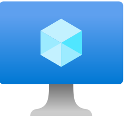
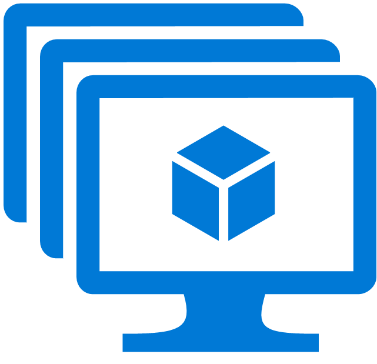
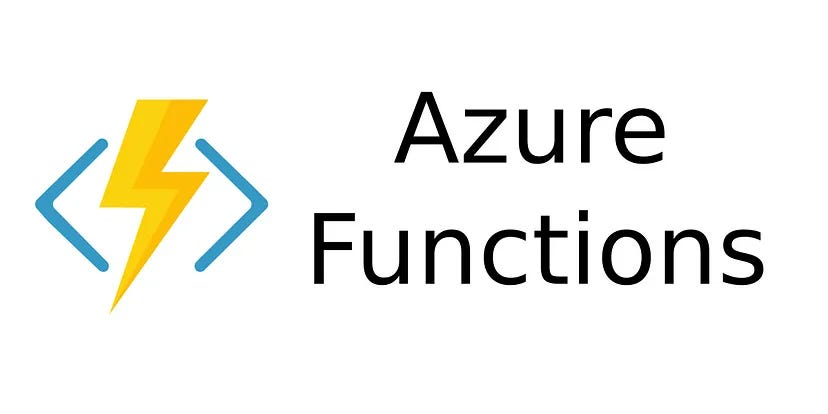
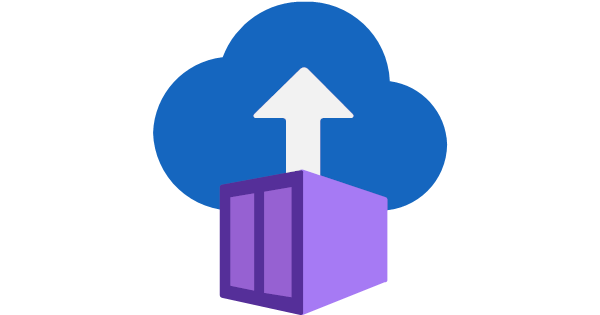
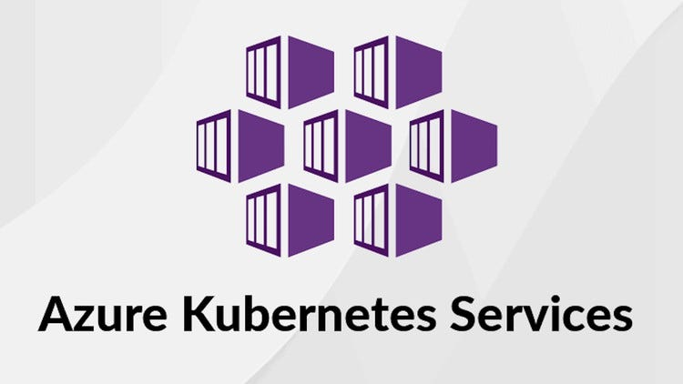
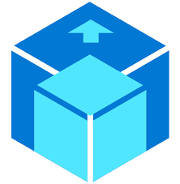

# Azure Compute Products:

Microsoft Azure Offers various Virtual Machine based compute products designed to meet different workload requirements. 

Standarad Virtual Machines(VMs), Virtual Machine Scale Sets(VMSS), and Compute Fleet are some of the Compute Products that provide flexibility and Scalibility for Various Applications.

## Virtual Machines (VMs):

  

**Description:** 

- VMs are the fundamental building blocks of Azure Compute. 

- They Offer full Control over the Operating System and applications, making them suitable for a wide range of workloads. 

- VMs provide the flexibility to choose the operating system, size and configuration that best fits your needs.

**Use Cases:** 

- Hosting traditional applications, databases, development and test environments, ow when you need specific OS configurations or software that isn't supported by PaaS.

**Control Level:** 

- IaaS (highest control).

## Virtual Machine Scale Sets(VMSS):

  

**Description:**

- VMSS extend the capabilities of VMs by enabling the deployment and management of a group of VMs. 

- This service is ideal for applications that require high availability or scalability.

- VMSS can ensure that your applications can handle varying loads efficiently by automatically increasing or decreasing the number of VMs in response to changes in demand.

**Use Cases:**

- Highly available and scalable applications, web servers, and distributed workloads.

**Control Level:**

- IaaS, with added management for Scaling

## Compute Fleet:

- `Compute Fleet` is designed for large-scale, distributed computing environments. It allows you to manage and orchestrate a fleet of VMs across multiple regions and availability zones.

- This service is particularly beneficial for high-performance computing(HPC) applications, big data processing, and other workloads that require significant computational power and distributed resources.

## Azure App Service:

  

**Description:**

-  A fully managed platform for building, deploying and scaling web apps, mobile app backends, and RESTful APIs.

- It supports various programming languages (e.g., .NET, Node.js, Java, Python, PHP).

**Use Cases:**

- Web applications, APIs, mobile backends, and other HTTP-based workloads where you want to focus on development rather than infrastructure management.

**Control Level:**

- PaaS

## Azure Functions:

  

**Description:**

- A serverless compute service that lets you run small pieces of code ("functions") in response to events (e.g., HTTP requests, database changes, timer events). 

- You only pay for the execution time.

**Use Cases:**

- Event-driven applications, real-time data processing, IoT backend, automated workflows, and microservices.

**Control Level:**

- FaaS/Serverless

## Azure Container Instances(ACI):

  

**Description:**

- A serverless container service that allows you to run containers directly on Azure without managing the underlying virtual machines or orchestration platforms like Kubernetes.

**Use Cases:**

- Running single containers or small groups of containers for quick deployments, development, testing, and burstable workloads.

**Control Level:**

- PaaS/Serverless (for containers).

## Azure Kubernetes service(AKS):

  

**Description:**

- A managed Kubernetes service that simplifies the deployment, management, and scaling of containerized applications using Kubernetes. 

- Azure handles the master nodes, and you manage the worker nodes.

**Use Cases:**

- Microservices architectures, complex containerized applications, and workloads requiring robust orchestration, self-healing, and scaling capabilities.

**Control Level:**

- PaaS (for Kubernetes orchestration).

## Azure Batch:

  

**Description:**

- A managed service for running large-scale parallel and high-performance computing (HPC) applications. 

- It efficiently provisions and manages compute resources on demand.

**Use Cases:**

- Data processing, simulations, rendering, and other compute-intensive tasks that can be broken down into parallel jobs.

## Azure Dedicated Host:

  

**Description:**

- Provides physical servers dedicated to your Azure subscription, giving you hardware isolation for compliance and performance reasons.

**Use Cases:**

- Meeting specific compliance requirements, licensing benefits, or when you need predictable performance for your VMs.

## Choosing The Right Service:

The best Azure compute service depends on your application's specific requirements, your desired level of control, and your operational overhead preferences.

- **High Control & Customization:** Azure VMs

- **Web Apps & APIs (managed):** Azure App Service

- **Event-Driven & Serverless Logic:** Azure Functions

- **Simple Container Deployment:** Azure Container Instances

- **Complex Container Orchestration (Kubernetes):** Azure Kubernetes Service

- **Large-Scale Parallel Processing:** Azure Batch

- **Hardware Isolation/Compliance:** Azure Dedicated Host

Azure Compute offers a flexible and comprehensive range of options to meet diverse computing needs, empowering businesses to build, deploy, and scale their applications efficiently in the cloud.
