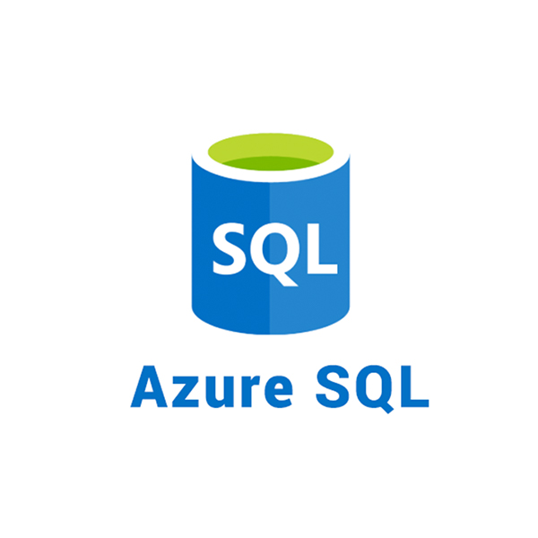

# Microsoft Azure Database Management & Services:

As a Microsoft Azure Certified Solutions Architect Expert, understanding and effectively leveraging Azure's comprehensive suite of database management and services is paramount. 

This section provides an overview of the various database offerings within Azure, designed to help architects choose the right solution for diverse application requirements, scalability needs, and operational considerations.

## Introduction to Azure Database Services:

- Azure offers a wide array of fully managed, highly scalable, and secure database services that cater to various data models and workloads. 

- From traditional relational databases to modern NoSQL solutions, analytical engines, and in-memory caches, Azure provides the building blocks for robust and performant data layers. 

- The "managed" aspect significantly reduces the operational overhead for infrastructure provisioning, patching, backups, and high availability, allowing developers and architects to focus on application logic and data optimization.

## Key Considerations for Solutions Architects:

When designing solutions with Azure databases, Solutions Architects typically evaluate the following:

**Workload Type:**

- Is it OLTP (Online Transaction Processing), OLAP (Online Analytical Processing), or a hybrid?

**Data Model:**

- Relational, document, key-value, graph, column-family, or time series?

**Scalability:**

- Horizontal (scale-out) vs. Vertical (scale-up)? How does it handle peak loads?

**Performance:**

- Latency, throughput, and IOPS requirements.

**High Availability & Disaster Recovery (HA/DR):**

- RTO (Recovery Time Objective) and RPO (Recovery Point Objective) needs. Global distribution and multi-region resilience.

**Security & Compliance:**

- Data encryption (at rest and in transit), network isolation (VNet integration, Private Link), access control (RBAC, Azure AD integration).

**Cost Optimization:**

- Consumption-based pricing, serverless options, reserved instances.

**Integration:**

- Compatibility with existing tools, development frameworks, and other Azure services (e.g., Azure Functions, Azure Kubernetes Service, Azure Synapse Analytics).

**Managed vs. Infrastructure-as-a-Service (IaaS):** Whether to use fully managed services or deploy databases on Azure VMs for greater control.

## Overview of Azure Database Services:

Azure provides a rich portfolio of database services, categorized by their underlying data model and primary use cases:

## Relational Databases:

For applications requiring structured data, ACID compliance, and complex querying with SQL.

### Azure SQL Database:

  

**PaaS (Platform-as-a-Service):**

- Fully managed, intelligent, and scalable relational database service based on the latest stable version of SQL Server.

**Deployment Options:**

- Single Database, Elastic Pools (for multiple databases with shared resources), Hyperscale (for very large databases), Serverless (for intermittent, unpredictable workloads).

### Azure SQL Managed Instance:

  

**PaaS:**

- Offers near 100% compatibility with the latest SQL Server on-premises (Enterprise Edition), making it ideal for migrating existing SQL Server applications with minimal changes. Provides VNet integration.

### Azure Database for PostgreSQL:

  

**PaaS:**

- Fully managed PostgreSQL service, offering flexible server, single server, and Hyperscale (Citus) options for distributed deployments.

### Azure Database for MySQL:

  

**PaaS:**

- Fully managed MySQL service, offering flexible server and single server deployment options.

### Azure Database for MariaDB:

  

**PaaS:**

- Fully managed MariaDB service.

## NoSQL Databases:

For applications requiring flexible schemas, high scalability, and low latency for unstructured or semi-structured data.

### Azure Cosmos DB:

  

**PaaS:**

- Microsoft's globally distributed, multi-model (SQL API, MongoDB API, Cassandra API, Gremlin API, Table API), low-latency NoSQL database service. Ideal for high-performance applications with global reach.

- Offers guaranteed single-digit millisecond latency and horizontal scalability.

### Azure Cache for Redis:

  

**PaaS:**

- Fully managed in-memory data store based on the open-source Redis. 

- Used for caching, session management, message brokering, and other real-time scenarios to improve application performance.

## Analytical & Data Warehousing:

For large-scale data analysis, business intelligence, and reporting.

### Azure Synapse Analytics:

  

**PaaS:**

- An integrated analytics service that brings together enterprise data warehousing and Big Data analytics.

- Offers SQL pools (for data warehousing), Apache Spark pools (for Big Data), and data integration capabilities.

### Azure Data Explorer:

  

**PaaS:**

- Fast, highly scalable data exploration service for log and telemetry data. 

- Ideal for real-time analytics on high-volume, high-velocity streaming data.

## Other Specialized Databases:

### Azure Managed Instance for Apache Cassandra:

  

**PaaS:**

- A fully managed service for deploying and maintaining Apache Cassandra clusters with hybrid capabilities.

### Azure Data Lake Storage Gen2:

  

**PaaS:**

- A highly scalable and secure data lake solution built on Azure Blob Storage, optimized for big data analytics workloads.

## Tools & Management:

Azure provides a rich set of tools for managing and interacting with its database services:

- **Azure Portal:** Web-based interface for provisioning, configuring, and monitoring database resources.

- **Azure CLI & PowerShell:** Command-line interfaces for automation and scripting.

- **Azure Resource Manager (ARM) Templates / Bicep:** Infrastructure-as-Code for repeatable deployments.

- **Azure Data Studio / SQL Server Management Studio (SSMS):** Client tools for SQL-based databases.

- **Open-source tools:** Compatibility with various open-source tools for specific database types (e.g., psql, mysql, MongoDB Compass).

- **Azure Monitor:** For comprehensive monitoring, logging, and alerting.

## Conclusion:

- The selection of the appropriate Azure database service is a critical architectural decision that directly impacts an application's performance, scalability, reliability, security, and cost-effectiveness. 

- By understanding the strengths and use cases of each offering, Solutions Architects can design robust, future-proof data solutions that meet the evolving demands of modern applications.

