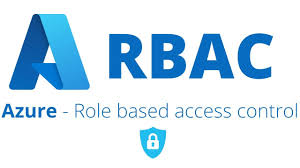

# Microsoft Sercirty & Identity Services Overview:

This document provides an overview of key security and identity management services within Microsoft Azure, crucial for architects designing secure and compliant cloud solutions.

Securing cloud resources and managing access are paramount in any Azure deployment. 

Azure offers a comprehensive suite of services that enable architects to implement robust security postures, enforce least privilege principles, and ensure regulatory compliance. 

This overview focuses on the core services vital for a Microsoft Azure Certified Solutions Architect.

## Microsoft Entra ID (formerly Azure Active Directory) - The Foundation:

  

Microsoft Entra ID is Microsoft's multi-tenant, cloud-based directory and identity management service. 

It's the cornerstone for managing user identities, authentication, and authorization for applications and resources in Azure, other clouds, and on-premises environments. 

It is a key component of the broader Microsoft Entra product family, which delivers comprehensive identity and network access solutions for a Zero Trust security model.

### Key Capabilities:

**Single Sign-On (SSO):**

- Enables users to access multiple applications with one set of credentials.

**Multi-Factor Authentication (MFA):**

- Adds an extra layer of security during sign-in.

**Conditional Access:**

- Enforces specific access controls based on user, device, location, and application conditions (now Microsoft Entra Conditional Access).

**Identity Protection:**

- Detects, protects, and remediates identity-based risks (part of Microsoft Entra ID Protection).

**Device Management:**

- Manages identities of devices connecting to your network, often integrated with Microsoft Intune.

**Application Management:**

- Integrates and manages access to thousands of SaaS applications.

**Hybrid Identity:**

- Synchronizes on-premises Active Directory with Microsoft Entra ID using Microsoft Entra Connect.

**Privileged Identity Management (PIM):**

- Strengthens the security of privileged accounts by providing just-in-time access and approval workflows (part of Microsoft Entra ID Governance).

**External Identities:**

- Securely manage access for customers and partners using features like B2B collaboration and B2C (now part of Microsoft Entra External ID).

## Azure Role-Based Access Control (RBAC) - Granular Authorization:

  

Azure RBAC is an authorization system built on Azure Resource Manager that provides fine-grained access management to Azure resources. It allows you to manage who has access to Azure resources, what they can do with those resources, and what areas they can access.

### Key Capabilities:

**Built-in Roles:**

- Predefined roles for common scenarios (e.g., Owner, Contributor, Reader, User Access Administrator).

**Custom Roles:**

- Create custom roles to define specific permissions tailored to your organization's needs.

**Scope of Assignment:**

-  Apply roles at different scopes: management group, subscription, resource group, or individual resource.

**Principle of Least Privilege:**

- Essential for ensuring users only have the permissions they absolutely need.

## Azure Key Vault - Secure Secret Management:

  

Azure Key Vault provides a secure, centralized store for cryptographic keys, secrets, and certificates. 

It helps solve the problem of managing and protecting sensitive data used by applications and services.

### Key Capabilities:

**Secrets Management:**

- Securely store and tightly control access to tokens, passwords, certificates, API keys, and other secrets.

**Key Management:**

- Create and control the encryption keys used to encrypt your data.

**Certificate Management:**

- Provision, manage, and deploy public and private SSL/TLS certificates.

**Hardware Security Module (HSM) Support:**

- For enhanced security, secrets and keys can be stored in FIPS 140-2 Level 2 validated HSMs.

## Azure Security Center / Microsoft Defender for Cloud - Unified Security Management:

  

Microsoft Defender for Cloud (formerly Azure Security Center) is a unified infrastructure security management system that strengthens the security posture of your cloud workloads and provides advanced threat protection across your hybrid workloads (Azure, on-premises, and other clouds).

### Key Capabilities:

**Security Posture Management:**

- Continuous assessment of your security configurations against security benchmarks and regulatory standards.

**Threat Protection:**

- Advanced threat detection and response capabilities for virtual machines, SQL databases, storage accounts, and more.

**Security Recommendations:**

- Actionable recommendations to improve your security score.

**Regulatory Compliance:**

- Monitor compliance against a wide range of regulatory standards (e.g., ISO 27001, PCI DSS).

**Just-in-Time VM Access:**

- Reduces the attack surface by locking down inbound traffic to your VMs.

## Azure Firewall - Network Security and Filtering:

  

Azure Firewall is a managed, cloud-based network security service that protects your Azure Virtual Network resources. 

It's a fully stateful firewall-as-a-service with built-in high availability and unrestricted cloud scalability.

### Key Capabilities:

**Traffic Filtering:**

- Allows or denies network traffic based on source, destination, port, and protocol.

**Threat Intelligence-Based Filtering:**

- Alerts and denies traffic from known malicious IP addresses and domains.

**FQDN Tag Filtering:**

- Simplifies network filtering for well-known Azure services.

**SNAT and DNAT Support:**

- Supports Source Network Address Translation (SNAT) and Destination Network Address Translation (DNAT).

**Integrated with Azure Monitor:**

- Provides logging and monitoring of network traffic.

## Azure DDoS Protection - Defending Against Denial of Service Attacks:

  

Azure DDoS Protection provides enhanced DDoS mitigation capabilities for your Azure resources. It's designed to protect public IP addresses hosted in Azure from volumetric, protocol, and resource-layer DDoS attacks.

### Key Capabilities:

**Always-on Traffic Monitoring:**

- Continuously monitors network traffic for indicators of DDoS attacks.

**Automatic Attack Mitigation:**

- Automatically mitigates attacks without any user intervention.

**Adaptive Tuning:**

- Learns your application's traffic patterns to reduce false positives.

**DDoS Protection Standard Plan:**

- Provides comprehensive protection with detailed attack analytics and metrics.

## Azure Front Door / Azure Application Gateway (WAF) - Web Application Protection:

  

These services offer Web Application Firewall (WAF) capabilities to protect web applications from common web vulnerabilities and exploits.

### Azure Front Door (with WAF):

- A scalable, global entry-point that uses the Microsoft global edge network to create fast, secure, and widely scalable web applications. Its WAF provides centralized protection for your web applications.

**Key WAF Capabilities (Front Door):** OWASP Top 10 protection, custom rules, rate limiting, geo-filtering.

### Azure Application Gateway (with WAF):

- A web traffic load balancer that enables you to manage traffic to your web applications. Its WAF provides centralized protection for your web applications.

**Key WAF Capabilities (Application Gateway):** OWASP Top 10 protection, custom rules, bot protection.

## Managed Identities for Azure Resources - Credential-Free Authentication:

  

Managed Identities for Azure resources provide an automatically managed identity in Microsoft Entra ID for Azure services. 

This service eliminates the need for developers to manage credentials (secrets, connection strings, API keys) when their applications need to authenticate to other Azure services that support Microsoft Entra authentication. 

Azure automatically handles the creation, rotation, and lifecycle of these identities, significantly enhancing security and simplifying development.

### Key Benefits:

**Eliminates Credential Management:**

- No more hardcoded secrets in code or configuration files, drastically reducing the risk of credential exposure.

**Enhanced Security:**

- Azure automatically manages and rotates the underlying credentials, which are not directly accessible to users or applications.

**Simplified Authentication:**

- Applications running on Azure resources can easily obtain Microsoft Entra ID tokens from a local endpoint.

**Leverages Azure RBAC:**

- Permissions are granted to the managed identity using Azure Role-Based Access Control, ensuring granular and least-privilege access.

## Architectural Considerations:

When designing secure Azure solutions, architects should consider:

- **Identity as the New Perimeter:** Emphasize strong identity controls and MFA.

- **Least Privilege Principle:** Grant only the necessary permissions to users and services.

- **Defense-in-Depth:** Implement multiple layers of security controls.

- **Automation:** Automate security tasks and policy enforcement.

- **Monitoring and Logging:** Continuously monitor security events and audit logs.

- **Regulatory Compliance:** Design solutions to meet relevant industry and government regulations.

- **Incident Response Plan:** Have a clear plan for responding to security incidents.
