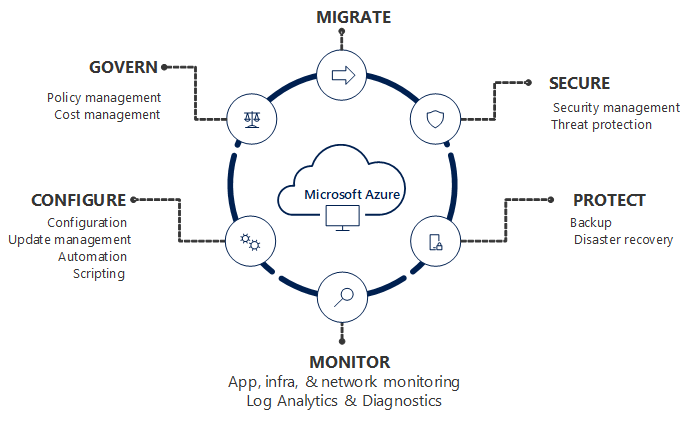
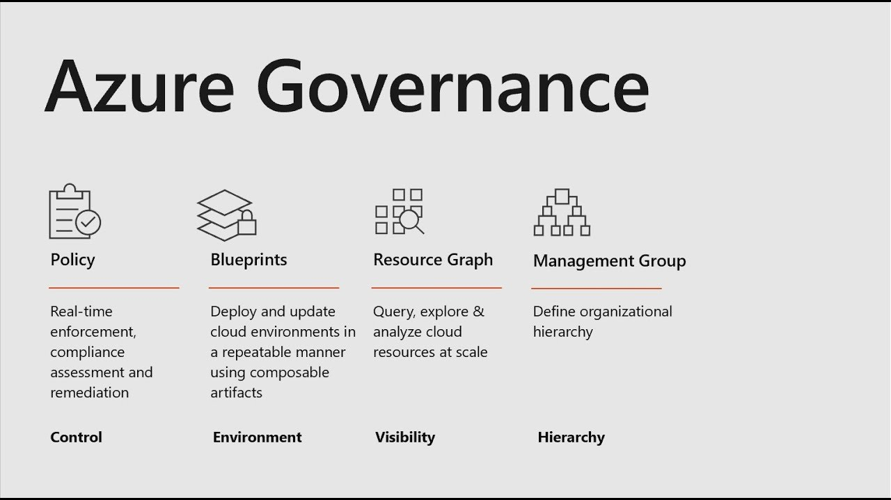
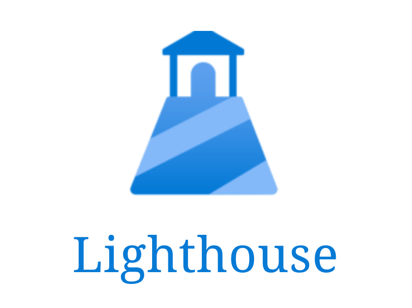
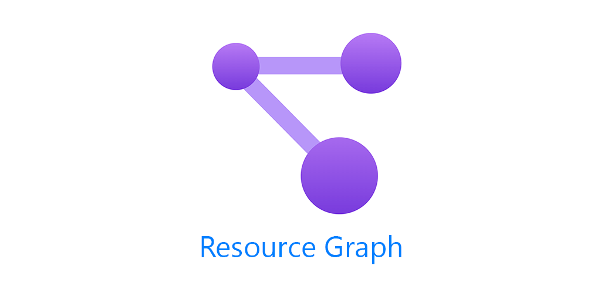
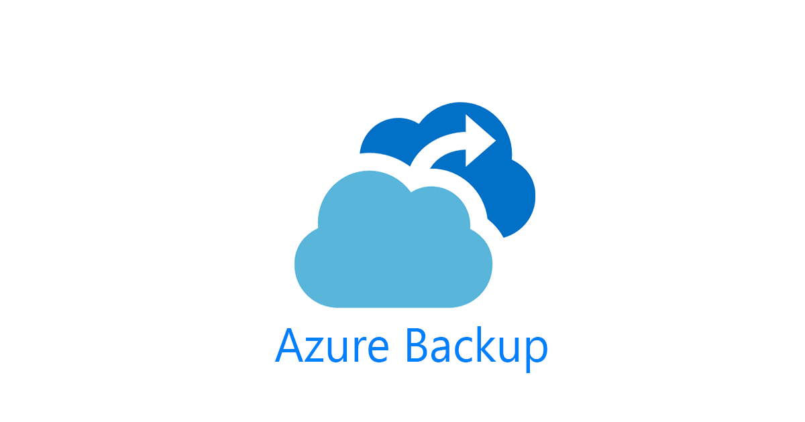
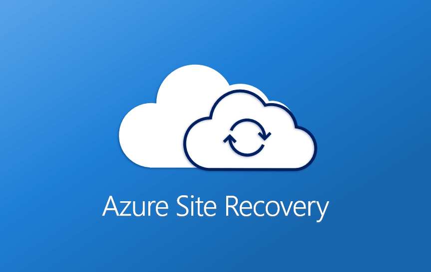

# Management and Governance Services:

<table style="border-spacing: 10px;">
  <tr>
    <td style="text-align: center;">
      
    </td>
    <td style="text-align: center;">
      
    </td>
  </tr>
</table>

This section of the study guide is dedicated to exploring the critical Management and Governance services within Microsoft Azure. 

For an Azure Solutions Architect Expert, mastering these services is not just about understanding their individual functions, but also about knowing how they integrate to form a cohesive strategy for operating, securing, and optimizing cloud environments.

We will delve into the following vital services, each playing a distinct yet interconnected role in managing the lifecycle and compliance of your Azure resources:

## Azure Monitor: 

  

- The cornerstone of observability, providing comprehensive data collection, analysis, and alerting across your applications, infrastructure, and network. 

- This includes `Log Analytics` for powerful query capabilities and `Application Insights` for deep application performance monitoring.

## Azure Security Center (now Microsoft Defender for Cloud):

  

- Your unified security management platform that provides advanced threat protection, security posture management, and compliance monitoring across hybrid cloud workloads.

## Azure Policy:

  

- Enables you to define, assign, and manage standards and guidelines for your Azure resources. 

- It helps ensure compliance with corporate standards, service level agreements, and regulatory requirements.

## Azure Cost Management + Billing:

  

- Provides the tools to understand your Azure spending, manage budgets, and optimize costs across your subscriptions and resources.

## Azure Lighthouse:

  

- Allows service providers to manage Azure resources for multiple customers from a single control plane, facilitating centralized management and governance. (While more for MSPs, its concepts are important for managing complex multi-subscription environments).

## Azure Resource Graph:

  

- An Azure service designed to provide efficient resource exploration with the ability to query across large sets of Azure subscriptions. 

- Essential for auditing and compliance reporting.

## Azure Automation:

  

- A cloud-based automation and configuration service that supports process automation (runbooks), update management, and configuration management for both Azure and non-Azure environments.

## Azure Backup:

  

- A scalable and cost-effective solution to protect your data by backing up virtual machines, SQL databases, Azure file shares, and more.

## Azure Site Recovery:

  

- A disaster recovery service that helps ensure business continuity by keeping business apps and workloads running during outages.

By exploring each of these services in detail, you will gain the knowledge and practical understanding necessary to design and implement robust management and governance solutions that meet the complex demands of enterprise-scale cloud deployments, a core competency for the Azure Solutions Architect Expert certification.