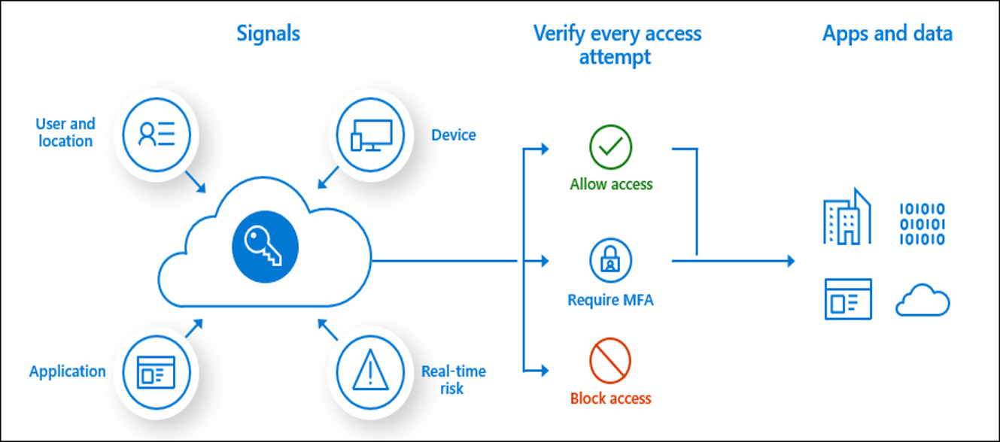

# Identity and Access Solutions:

  

In the realm of cloud architecture, Identity and Access Management (IAM) is arguably the most critical pillar of security. 

For an Azure Solutions Architect Expert, designing robust, scalable, and secure identity solutions is not just a best practice; it's a fundamental requirement. 

This section of the study guide will comprehensively cover the core services that empower you to manage and control access to your Azure resources and applications, ensuring the principle of least privilege and a strong security posture.

A deep dive into these services will equip you with the knowledge to:

**Securely manage user and application identities:**

- Control who can access what, from where, and under what conditions.

**Implement strong authentication and authorization mechanisms:**

- Leverage multi-factor authentication, conditional access, and granular role-based access control.

**Integrate hybrid identity environments:**

- Seamlessly connect on-premises identity systems with Azure AD.

**Automate identity governance:**

- Streamline the lifecycle of identities and access permissions.

**Protect sensitive information:**

- Ensure data is accessed only by authorized entities.

We will focus on the following indispensable Azure services that form the backbone of identity and access solutions:

## Microsoft Entra ID (formerly Azure Active Directory):

  

The comprehensive cloud-based identity and access management service that provides a single control plane for managing users, groups, applications, and devices. This includes:

* **User and Group Management:** Creating and managing identities for people and logical groups.

* **Application Registrations & Enterprise Applications:** Securing access to applications, both custom-built and SaaS.

* **Authentication Methods:** Implementing various authentication options like password hash synchronization, pass-through authentication, federation, and multi-factor authentication (MFA).

* **Conditional Access:** Enforcing policies to control access based on user, location, device, and application.

* **Identity Protection:** Detecting and remediating identity-based risks.

** **Privileged Identity Management (PIM):** Managing, controlling, and monitoring access to important resources in Azure AD, Azure, and other Microsoft online services, including just-in-time (JIT) access.

* **Access Reviews:** Periodically reviewing user access to resources to ensure it remains appropriate.

* **Hybrid Identity (Azure AD Connect):** Synchronizing identities between on-premises Active Directory and Microsoft Entra ID.

* **Microsoft Entra Domain Services:** Providing managed domain services in Azure, compatible with traditional Active Directory.

## Managed Identities for Azure Resources:

A feature of Microsoft Entra ID that allows Azure services to authenticate to other services securely without needing to manage credentials directly. This includes:

* **System-assigned managed identities**

* **User-assigned managed identities**

## Role-Based Access Control (RBAC):

* Azure's authorization system for fine-grained access management to Azure resources.

## Azure Key Vault:

* A service for securely storing and managing cryptographic keys, certificates, and secrets (like API keys and passwords). 

* Often used in conjunction with managed identities for application authentication.

By understanding how these services function independently and integrate into a cohesive strategy, you will be well-prepared to design robust and secure identity and access solutions for any Azure workload, a critical skill for the Azure Solutions Architect Expert role.