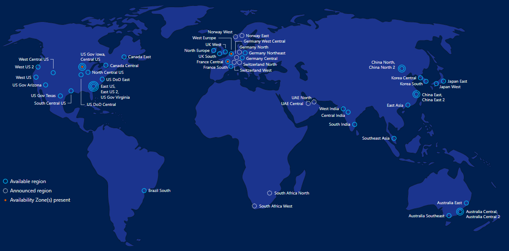
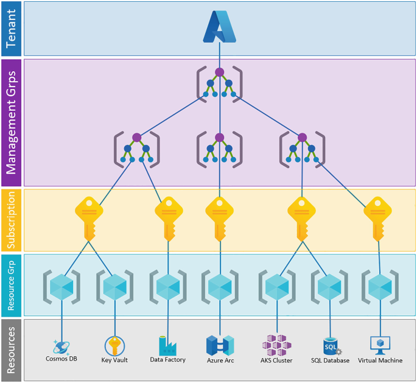

# **Module 1.2: Understanding Azure Architecture & Core Concepts**

  

To effectively utilize Azure, it's essential to understand its underlying architecture and how resources are organized and managed. This module delves into the foundational components that make up the Azure cloud.

---

## **Azure Global Infrastructure:**

Azure's global infrastructure is designed for massive scale, high availability, and disaster recovery, distributing resources across the world.

**Geographies:**

* **Description:** A discrete market, typically containing two or more Azure Regions, that preserves data residency and compliance boundaries. Geographies allow customers with specific data residency and compliance requirements to keep their data and applications close.

* **Purpose:** Data residency, compliance, and disaster recovery within a broader geopolitical boundary.

* **Example:** Americas, Europe, Asia Pacific.

**Regions:**

* **Description:** A set of datacenters deployed within a latency-defined perimeter and connected through a dedicated, low-latency network. Regions are the fundamental building blocks of Azure's global infrastructure.

* **Purpose:** To provide customers with flexibility in deploying applications closer to their users for better performance and to meet data residency requirements. Each region is paired with another region within the same geography (e.g., East US 2 paired with Central US) for disaster recovery purposes.

* **Example:** East US, West Europe, Southeast Asia.

**Availability Zones (AZs):**

* **Description:** Physically separate locations within an Azure region. Each Availability Zone is made up of one or more datacenters equipped with independent power, cooling, and networking. They are connected by a high-speed, low-latency network.

* **Purpose:** To protect applications and data from datacenter failures. If one zone goes down, the others in the same region continue to operate. They offer higher availability than simply deploying within a single datacenter.
* **Example:** Within the "East US 2" region, there might be "East US 2 - Zone 1", "East US 2 - Zone 2", and "East US 2 - Zone 3".

* **Note:** Not all Azure regions support Availability Zones.

## **Azure Resource Manager (ARM)**

Azure Resource Manager (ARM) is the deployment and management service for Azure. It provides a management layer that enables you to create, update, and delete resources in your Azure subscription. When you use any Azure tool (Azure Portal, Azure PowerShell, Azure CLI, REST API, client SDKs), ARM is the underlying service that processes your request.

**Key Capabilities:**

* **Declarative Management:** Define your infrastructure and configurations in a template (ARM template, Bicep) and deploy it repeatedly and consistently.

* **Resource Grouping:** Group related resources together for easier management, billing, and lifecycle.

* **Role-Based Access Control (RBAC):** Apply fine-grained access control to resources.

* **Tagging:** Organize resources logically for management, cost reporting, and automation.
* **Auditing:** Track all actions performed on your resources.

---

## **Management Groups, Subscriptions, Resource Groups, Resources:**

  

Azure organizes resources in a hierarchical structure to help you manage access, policies, and billing effectively.

**Management Groups:**

* **Description:** Containers that help you manage access, policy, and compliance for multiple subscriptions. All subscriptions within a management group automatically inherit the conditions applied to the management group.

* **Purpose:** To provide enterprise-grade governance at scale, allowing you to apply policies and RBAC roles to a large set of subscriptions.

* **Hierarchy:** Management Groups > Subscriptions > Resource Groups > Resources.

**Subscriptions:**

* **Description:** A logical container that links Azure services to an Azure account. It's a billing boundary (resources consumed in a subscription are billed together) and a security boundary (access control is managed at the subscription level).

* **Purpose:** To organize resources for billing and to apply access policies. You can have multiple subscriptions under a single Azure account.

* **Relationship:** Resources belong to Resource Groups, which belong to Subscriptions.

**Resource Groups:**

* **Description:** A logical container for Azure resources. Resources in a resource group share a common lifecycle (e.g., they are deployed, updated, and deleted together).

* **Purpose:** To organize related resources for easier management, monitoring, and cost tracking. A resource can only be in one resource group.

* **Example:** A web application, its database, and storage account might all be in the same resource group.

**Resources:**

* **Description:** Individual instances of services that you create in Azure.

* **Purpose:** The actual components that provide functionality in your cloud solution.

* **Examples:** Azure Virtual Machine, Azure App Service, Azure SQL Database, Azure Storage Account.

---

### **Azure Portal, Azure CLI, Azure PowerShell, ARM Templates (Introduction):**

Azure provides various tools to interact with and manage your resources, catering to different preferences and automation needs.

**Azure Portal:**

* **Description:** A web-based, unified console that provides a graphical user interface (GUI) to manage your Azure resources.

* **Purpose:** Ideal for beginners, visual management, quick tasks, and monitoring.

* **Access:** portal.azure.com

* **Azure CLI (Command-Line Interface):**

* **Description:** A cross-platform command-line tool that allows you to execute commands through a terminal using Bash, PowerShell, or Command Prompt.

* **Purpose:** Automation, scripting, managing resources programmatically, and for users who prefer command-line interactions.

* **Installation:** Can be installed on Windows, macOS, and Linux, or used directly in Azure Cloud Shell.

**Azure PowerShell:**

* **Description:** A set of cmdlets (command-lets) for PowerShell that enables you to manage Azure resources directly from PowerShell.

* **Purpose:** Automation, scripting, for users familiar with PowerShell, and leveraging PowerShell's object-oriented nature for complex tasks.

* **Installation:** Can be installed as a module for PowerShell, or used directly in Azure Cloud Shell.

**ARM Templates (Azure Resource Manager Templates) / Bicep (Introduction):**

* **ARM Templates:** JSON (JavaScript Object Notation) files that define the infrastructure and configuration for your Azure solution. They are declarative, meaning you state what you want to deploy, and ARM handles the orchestration.

* **Bicep:** A domain-specific language (DSL) for deploying Azure resources declaratively. It's a transparent abstraction over ARM JSON, offering a cleaner syntax, better modularity, and improved authoring experience. Bicep compiles directly to ARM JSON.

* **Purpose:** Infrastructure as Code (IaC). Enables consistent, repeatable deployments, version control of your infrastructure, and automation of complex environments.

* **Benefits:** Idempotency (running the same template multiple times yields the same result), error reduction, rapid deployments.

---