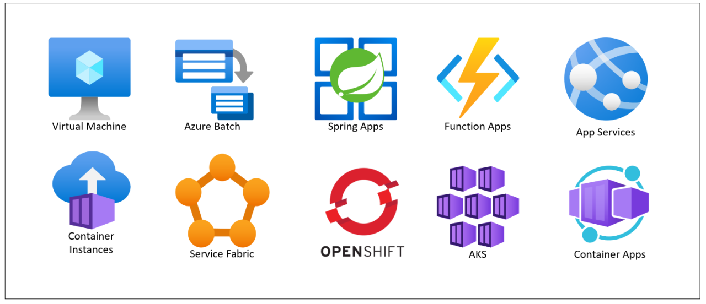

# **Module 1.3: Core Azure Compute Services:**

  

Azure offers a wide range of compute services, allowing you to choose the right tool for your workload based on factors like control, scalability, manageability, and cost.

## **Azure Virtual Machines (VMs)**

Azure Virtual Machines (VMs) are an **Infrastructure as a Service (IaaS)** offering that provides you with virtualized servers in the cloud. They give you the flexibility of virtualization without the need to buy and maintain the physical hardware that runs them.

**Purpose and Use Cases:**

* **"Lift and Shift" Migrations:** Easily migrate existing on-premises applications to Azure without significant re-architecture.

* **Dev/Test Environments:** Quickly provision and de-provision development and testing machines.

* **Legacy Applications:** Run applications that require specific operating systems or configurations not supported by PaaS.

* **Custom Software:** Deploy applications requiring full control over the operating system and software stack.

* **Infrastructure Control:** When you need operating system-level access and the ability to install custom software or drivers.

**VM Sizes and Types:**

* Azure offers a vast array of VM sizes, each optimized for different workloads based on factors like vCPUs, memory, disk I/O, and networking performance.

* **General Purpose (e.g., Dv3-series, B-series):** Good for most business workloads, dev/test, small to medium databases.

* **Compute Optimized (e.g., Fs-series):** High CPU-to-memory ratio, good for medium traffic web servers, application servers, batch processes.

* **Memory Optimized (e.g., Ev3-series, M-series):** High memory-to-CPU ratio, ideal for relational database servers, in-memory analytics.

* **Storage Optimized (e.g., Ls-series):** High disk I/O, good for NoSQL databases, data warehousing.

* **GPU Optimized (e.g., N-series):** For graphics rendering, video editing, machine learning, and deep learning.

* **High Performance Compute (HPC) (e.g., H-series, HB-series):** Fastest and most powerful CPU VMs, designed for high-end computational fluid dynamics, finite element analysis, etc.

**Availability Options for VMs:** To ensure high availability and resilience for your VM-based applications, Azure provides several options:

## **Availability Sets:**

* **Description:** A logical grouping of two or more VMs that provides redundancy and availability by distributing them across different isolated hardware in a single data center within an Azure region.

* **Purpose:** Protects against planned maintenance events (updates) and unplanned hardware failures (network switch, power unit). VMs in an availability set are spread across different **Fault Domains** (isolated hardware) and **Update Domains** (logical grouping for concurrent updates).

* **Limitations:** Protects against failures within a single datacenter; does not protect against regional disasters or datacenter-wide outages.

## **Availability Zones (Introduction):**

* **Description:** Physically separate locations within an Azure region, each with independent power, cooling, and networking. VMs deployed across Availability Zones are protected from entire datacenter failures.

* **Purpose:** Provides the highest level of intra-region high availability. If one zone experiences an outage, your application remains available in the other zones.

* **Benefit over Availability Sets:** Protects against broader datacenter-level failures.

## **Virtual Machine Scale Sets (VMSS) (Introduction):**

* **Description:** An Azure compute resource that you can use to deploy and manage a set of identical, auto-scaling virtual machines. It simplifies the deployment, management, and auto-scaling of large numbers of VMs.

* **Purpose:** Ideal for large-scale, load-balanced workloads. Automatically scales VMs up or down based on metrics (e.g., CPU utilization, network traffic).

* **Integration:** Can deploy VMs across Availability Zones for maximum resilience.

## **Azure App Service**

Azure App Service is a fully managed **Platform as a Service (PaaS)** offering for building, deploying, and scaling web apps, mobile backends, and RESTful APIs. It automates the management of the underlying infrastructure, including OS patching, capacity provisioning, and load balancing.

**Purpose and Use Cases:**

* **Web Apps:** Host web applications built with .NET, Java, Node.js, Python, PHP, or Ruby.

* **API Apps:** Build and host RESTful APIs.

* **Mobile Apps:** Provide a backend for mobile applications, including authentication, push notifications, and offline data sync.

* **Logic Apps (Note: While Logic Apps is a separate PaaS/SaaS integration service, it's sometimes grouped here due to its application-oriented nature. For compute, App Service is focused on hosting custom code).**

* **Serverless Web Hosting:** While not strictly serverless like Functions, it can scale to zero instances in some plans, offering near-serverless cost benefits.

### **App Service Plans (SKUs, scaling):**

* An **App Service Plan** is the underlying compute resource for your App Service apps. It defines the region, size (VM type), and scale count (number of VM instances) for your web apps.

* **SKUs (Service Tiers):**

* **Free/Shared:** For dev/test, non-production. Limited features, no custom domains, shared infrastructure.

* **Basic:** Small production, custom domains, no auto-scaling.

* **Standard:** Production workloads, auto-scaling, traffic slots.

* **Premium:** Higher performance, more scale units, private network capabilities (VNet integration).

* **Isolated:** Dedicated Azure Virtual Networks for maximum isolation and network control for highly sensitive applications.

* **Scaling:** App Service supports both **manual scaling** (you set the instance count) and **auto-scaling** (scales automatically based on metrics like CPU usage, HTTP queue length).

## **Azure Container Instances (ACI)**

Azure Container Instances (ACI) is a **serverless container service** that allows you to run Docker containers directly in Azure without managing virtual machines or orchestrators. It's the fastest and simplest way to run a container in Azure.

**Purpose and Use Cases:**

* **Simple Container Deployments:** For single container applications or simple batch jobs that don't require full orchestration.

* **Burst Workloads:** Quickly spin up containers for short-lived, burstable tasks.

* **Development and Testing:** Rapid prototyping and testing of containerized applications.

* **Event-Driven Processing:** Integrate with event sources to process data.

## **Azure Kubernetes Service (AKS) (Introduction)**

Azure Kubernetes Service (AKS) is a fully managed Kubernetes service. Kubernetes is an open-source container orchestration platform that automates the deployment, scaling, and management of containerized applications. AKS simplifies deploying a managed Kubernetes cluster in Azure.

**Purpose and Use Cases:**

* **Microservices Architectures:** Ideal for complex microservices deployments with many interdependent services.

* **Container Orchestration:** Automates scaling, load balancing, self-healing, and rolling updates for containerized applications.

* **Hybrid Deployments:** Can integrate with on-premises Kubernetes or extend to edge devices.

* **Machine Learning Workloads:** Running ML training and inference in containers.

* **Lift and Shift Existing Kubernetes:** Migrate existing Kubernetes workloads to a managed service.

## **Azure Functions (Introduction to Serverless Compute)**

Azure Functions is a **serverless compute service** that enables you to run small pieces of code ("functions") without explicitly provisioning or managing infrastructure. You only pay for the compute resources consumed while your code is running.

**Purpose and Use Cases:**

* **Event-Driven Workloads:** Responding to events like HTTP requests, database changes, messages in a queue, or timers.

* **API Backends:** Building lightweight, scalable APIs.

* **Data Processing:** Real-time stream processing, data transformation.

* **IoT Scenarios:** Processing data from IoT devices.

* **Scheduled Tasks:** Running background jobs on a schedule.

* **Key Characteristic:** You write the code, and Azure takes care of scaling and infrastructure. It's "serverless" because you don't manage the servers.

---