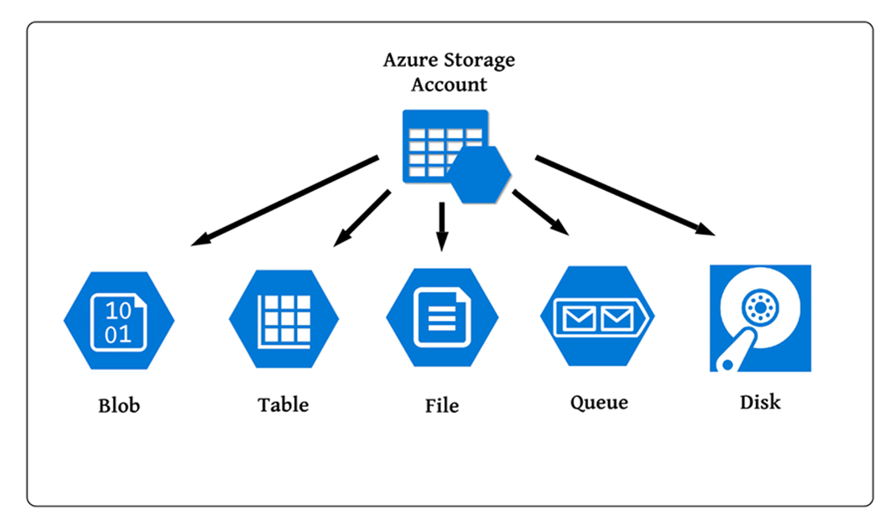

# **Module 1.4: Core Azure Storage Services**

  

Azure Storage is a massively scalable, highly available, and secure cloud storage solution for all your data needs, from unstructured objects to structured NoSQL tables and traditional file shares.

## **Azure Storage Accounts**

An Azure Storage account is the top-level container that holds all your Azure Storage data objects: blobs, files, queues, tables, and disks. The storage account provides a unique namespace for your Azure Storage data that is accessible from anywhere in the world over HTTP or HTTPS.

**Storage Account Types:**

* **General-purpose v2 (recommended):** This is the most common and recommended storage account type. It supports all Azure Storage services (Blobs, Files, Queues, Tables, and Disks) and offers all the latest features, including the ability to choose between hot, cool, and archive access tiers for blobs.

* **Premium Block Blobs:** Optimized for high transaction rates and consistent low-latency for block blobs and append blobs.

* **Premium File Shares:** Optimized for high-performance file shares.

* **Premium Page Blobs:** Optimized for virtual machine disks (page blobs).

* *(Note: General-purpose v1 and Blob Storage accounts are older, legacy types and generally not recommended for new deployments unless specific legacy compatibility is required.)*

**Redundancy Options:** Azure Storage offers several options for data redundancy to ensure high durability and availability, even in the face of hardware failures or regional disasters. You select the redundancy option when you create the storage account, and it applies to all data within that account.

* **Locally Redundant Storage (LRS):**

    * **Description:** Replicates your data three times within a single data center in the primary region.

    * **Durability:** Protects against local hardware failures (disk drive or server rack failure).

    * **Best For:** Applications that can easily reconstruct lost data, or if data governance requires data to reside within a single data center. Least expensive.

* **Zone-Redundant Storage (ZRS):**

    * **Description:** Replicates your data synchronously across three Azure Availability Zones in the primary region. Each Availability Zone is a separate physical location with independent power, cooling, and networking.
    
    * **Durability:** Protects against datacenter-level failures within a region.
    
    * **Best For:** Applications requiring high availability within a region.

* **Geo-Redundant Storage (GRS):**

        * **Description:** Replicates your data synchronously three times within a single physical location in the primary region (LRS), then asynchronously replicates it to a single physical location in a secondary region (hundreds of miles away). Data is readable in the secondary region only if Microsoft initiates a failover.

        * **Durability:** Protects against regional outages and major disasters.

        * **Best For:** Applications requiring protection from regional disasters where you don't need read access to the secondary region until a failover.

* **Read-Access Geo-Redundant Storage (RA-GRS):**

        * **Description:** Similar to GRS, but provides read access to the data in the secondary region at any time, even without a failover. This allows you to perform read-only operations from the secondary region, improving read availability.

        * **Durability:** Same as GRS, with added read availability.

        * **Best For:** Applications that need maximum durability and also require read access to the secondary region for high availability during outages in the primary.

* **Geo-Zone-Redundant Storage (GZRS):**

        * **Description:** Combines the high availability of ZRS in the primary region with geo-replication to a secondary region. Your data is replicated synchronously across three Availability Zones in the primary region and then asynchronously replicated to a single physical location in a secondary region.

        * **Durability:** Offers the highest durability and availability, protecting against both datacenter-level failures and regional disasters.

        * **Best For:** Mission-critical applications requiring maximum uptime and data resilience.

* **Read-Access Geo-Zone-Redundant Storage (RA-GZRS):**

        * **Description:** Similar to GZRS, but allows read access to the data in the secondary region at any time.

        * **Durability:** Highest durability and availability, with added read availability to the secondary region.

        * **Best For:** Extremely demanding applications that need both maximum resilience and continuous read availability from the geo-replicated secondary.

## **Blob Storage**

Azure Blob Storage is Microsoft's object storage solution for the cloud. It is optimized for storing massive amounts of unstructured data, such as text or binary data.

**Types of Blobs:**

* **Block Blobs:** Ideal for storing digital documents, images, video files, backups, and other large, discrete objects. They are composed of blocks of data that can be managed individually. Most common blob type.

* **Append Blobs:** Optimized for append operations, making them suitable for logging data from VMs or IoT devices where new data is continuously added to the end of a file.

* **Page Blobs:** Optimized for random read/write operations and used as the basis for Azure IaaS Virtual Machine Disks.

**Access Tiers (for Block Blobs in General-purpose v2 accounts):** Blob storage offers different access tiers to help you manage costs based on how frequently the data is accessed.

**Hot Tier:**

* **Purpose:** For data that is accessed or modified frequently.

* **Cost:** Higher storage costs, but lower access and transaction costs.

* **Latency:** Milliseconds.

* **Use Cases:** Active application data, frequently accessed files, data for real-time analytics.

**Cool Tier:**

* **Purpose:** For data that is infrequently accessed or modified. Data should be stored for a minimum of 30 days.

* **Cost:** Lower storage costs than Hot, but higher access and transaction costs.

* **Latency:** Milliseconds.

* **Use Cases:** Short-term backup, disaster recovery, older data sets not frequently used but expected to be available for immediate access.

**Cold Tier:**

* **Purpose:** An online tier for data that is rarely accessed or modified, but still requires immediate retrieval. Data should be stored for a minimum of 90 days.

* **Cost:** Lower storage costs than Cool, but higher access and transaction costs.

* **Latency:** Milliseconds.

* **Use Cases:** Rarely accessed data that needs quick access, but where storage cost is a primary concern.

**Archive Tier:**

* **Purpose:** For data that is rarely accessed, has flexible latency requirements (on the order of hours), and can be stored for long periods. Data should be stored for a minimum of 180 days.

* **Cost:** Lowest storage costs, but highest access costs and retrieval latency. Data is "offline."

* **Latency:** Hours (requires "rehydration" to Hot, Cool, or Cold tier before it can be read).

* **Use Cases:** Long-term backups, archival data, compliance data that needs to be preserved.

## **Azure Files (File Shares)**

Azure Files enables you to set up highly available network file shares in the cloud using the standard Server Message Block (SMB) or Network File System (NFS) protocols. 

These shares can be mounted concurrently by cloud or on-premises deployments of Windows, Linux, and macOS.

**Purpose and Use Cases:**

* **Replace On-premises File Servers:** Migrate traditional file server functionality to the cloud.

* **"Lift and Shift" Applications:** Easily move applications to the cloud that rely on a file share to store application or user data.

* **Shared Application Settings/Logs:** Centralize configuration files, logs, and diagnostic data for distributed applications.

* **Dev/Test/Debug:** Provide a central repository for developer tools and utilities across VMs.

* **Container Persistence:** Use as persistent volumes for stateful containers (e.g., in Azure Kubernetes Service).

* **Azure File Sync:** Cache Azure file shares on Windows Servers (on-premises or in Azure VMs) for local performance and distributed caching, with sync back to Azure Files.

## **Azure Queue Storage**

Azure Queue Storage is a service for storing large numbers of messages. 

It's used to decouple components of an application, enabling them to process messages asynchronously and independently.

**Purpose and Use Cases:**

* **Decouple Application Components:** Allows different parts of an application to communicate without direct dependencies. The sending component places a message in the queue, and the receiving component retrieves it later.

* **Asynchronous Messaging:** Enables background processing, ensuring that user-facing applications remain responsive.

* **Load Leveling:** Helps handle bursts of traffic by buffering requests, preventing backend systems from being overwhelmed.

* **Task Distribution:** Distribute tasks to multiple worker instances for parallel processing.

* **Durable Messaging:** Messages are persisted in Azure Storage, ensuring they are not lost even if consumers fail.

## **Azure Table Storage**

Azure Table Storage is a NoSQL key-value store service that allows you to store large amounts of structured, non-relational data in the cloud. It provides a schemaless design, meaning entities in the same table can have different sets of properties.

**Purpose and Use Cases:**

* **Flexible Datasets:** Store data that doesn't fit well into a traditional relational database, such as user profiles, device information, web logs, or other types of metadata.

* **Massive Scale:** Designed for extremely large datasets (terabytes) with high transaction rates.

* **Cost-Effective:** Often more cost-effective for large volumes of simple, structured data compared to relational databases.

* **Fast Access:** Offers quick access for querying data using primary keys.

* *(Note: For more advanced NoSQL needs, particularly with global distribution, multi-model support, and guaranteed low latency, Azure Cosmos DB for Table API is the modern successor to Azure Table Storage.)*

#### **Disk Storage (Managed Disks)**

Azure Managed Disks are block-level storage volumes for Azure Virtual Machines (VMs). They are managed by Azure and abstract the underlying storage accounts, providing simpler disk management, higher scalability, and better reliability.

**Benefits of Managed Disks:**

    * **Simplified Management:** You just create the disk, and Azure handles its placement, scalability, and availability.

    * **High Availability:** Automatically places disks into different storage scale units to avoid single points of failure.

    * **Scalability:** Supports much larger VM scale sets.

    * **Security:** Encryption at rest is built-in.

**Managed Disk Types (based on performance and cost):**

    1.  **Standard HDD (Hard Disk Drives):**
        * **Purpose:** Cost-effective storage for infrequently accessed data.
        * **Performance:** Lowest performance (IOPS, throughput).
        * **Use Cases:** Backups, non-critical dev/test workloads, archival.

    2.  **Standard SSD (Solid State Drives):**
        * **Purpose:** Good balance of cost and performance.
        * **Performance:** Consistent performance, higher than HDDs.
        * **Use Cases:** Web servers, lightly used enterprise applications, dev/test environments.

    3.  **Premium SSD (Solid State Drives):**
        * **Purpose:** High-performance storage for I/O-intensive workloads.
        * **Performance:** Significantly higher IOPS and throughput, very low latency.
        * **Use Cases:** Production databases (SQL Server, Oracle), mission-critical applications, high-performance web applications.

    4.  **Premium SSD v2 (Newer Generation):**
        * **Purpose:** Next generation of Premium SSDs, offering more flexibility in configuring performance independently of capacity.
        * **Performance:** Very high IOPS and throughput, lower latency than Premium SSD.
        * **Use Cases:** Performance-sensitive production workloads that consistently require low latency and high IOPS/throughput.

    5.  **Ultra Disk (SSD):**
        * **Purpose:** The highest-performing disk storage option for Azure VMs. Designed for extreme I/O-intensive workloads.
        * **Performance:** Provides consistent sub-millisecond latency and can provision IOPS and throughput independently (e.g., scale IOPS without increasing disk size).
        * **Use Cases:** Top-tier databases (e.g., SAP HANA, large SQL/Oracle), transaction-heavy workloads, demanding HPC applications.

---