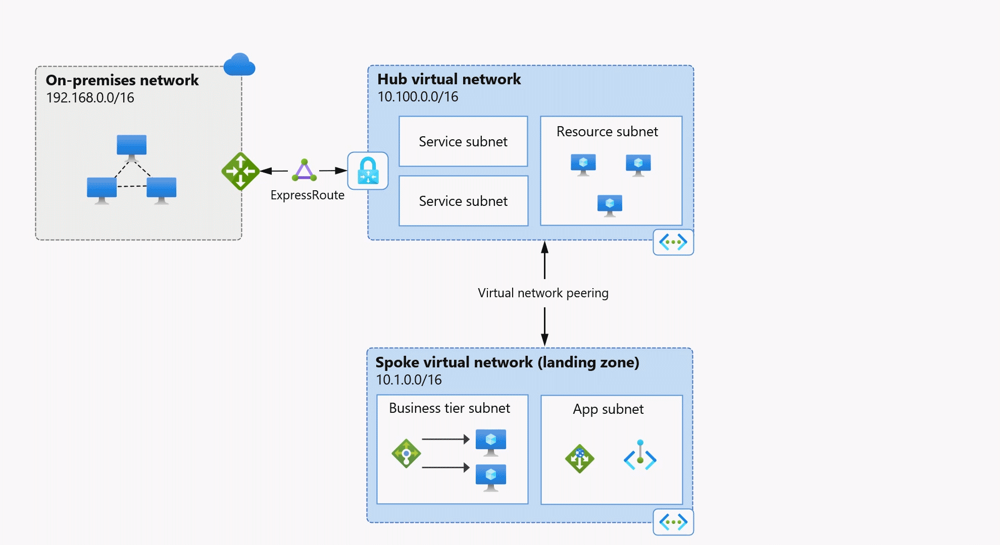
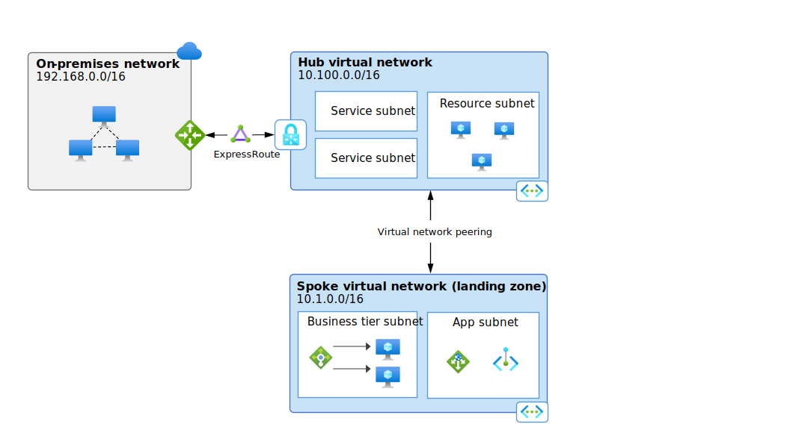
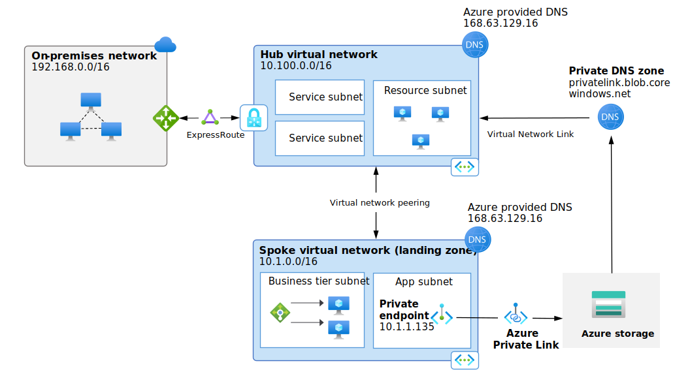

# **Module 1.5: Core Azure Networking Fundamentals (High-Level):**

  

Networking in Azure forms the foundation for connecting your cloud resources and enabling communication. 

Understanding these core concepts is crucial for designing secure and efficient cloud solutions.

## **Azure Virtual Network (VNet) (Introduction to private networks)**

  

**Description:** 

* An Azure Virtual Network (VNet) is the fundamental building block for your private network in Azure. 

* It enables Azure resources (like VMs) to securely communicate with each other, the internet, and on-premises networks. It is logically isolated from other virtual networks in Azure.

**Purpose:**

* **Isolation:** Provides a logically isolated network for your resources, separate from other Azure customers.

* **Secure Communication:** Enables secure communication between Azure resources (e.g., VMs talking to databases).

* **Internet Connectivity:** Allows resources to communicate with the internet (outbound by default, inbound needs explicit configuration).

* **Hybrid Connectivity:** Connects your Azure resources to your on-premises networks (e.g., via VPN or ExpressRoute).

* **Traffic Control:** Allows you to control traffic flow using security rules and routing.

**Key Idea:** Think of an Azure VNet as your own private network in the cloud that you can configure with your own IP address ranges, subnets, and security policies.

## **Subnets:**

**Description:** 

* A VNet can be segmented into one or more subnets. A subnet is a range of IP addresses within the VNet's address space. You deploy Azure resources into specific subnets.

**Purpose:**

* **Segmentation:** Logically separates resources within a VNet. For example, you might have a "Web Subnet" for front-end servers and a "Database Subnet" for database servers.

* **Security:** Enables you to apply different network security rules (using NSGs) to different groups of resources based on their function or sensitivity.

* **IP Address Management:** Helps efficiently allocate and manage IP addresses within your VNet.

## **IP Addressing (Public vs. Private):**

Azure resources can be assigned different types of IP addresses for communication.

**Private IP Addresses:**

* **Description:** IP addresses assigned to resources *within* an Azure VNet. They are not directly accessible from the internet.

* **Purpose:** Enable secure and private communication between resources within the same VNet, peered VNets, or connected on-premises networks.

* **Ranges:** Typically fall within RFC 1918 private IP ranges (e.g., 10.0.0.0/8, 172.16.0.0/12, 192.168.0.0/16).

* **Example:** A VM's network interface card (NIC) will have a private IP address for internal communication.

**Public IP Addresses:**

* **Description:** Globally routable IP addresses that enable direct communication between Azure resources and the internet.

* **Purpose:** Required for resources that need to be directly accessible from the internet (e.g., a public-facing web server, a load balancer).

* **Assignment:** Can be assigned dynamically (changes on deallocation/reallocation) or statically (remains the same even after resource restart).

* **Example:** A web server VM might have a public IP address assigned to its NIC to allow users on the internet to reach it.

## **Network Security Groups (NSGs) (Basic Firewalling):**

**Description:** Network Security Groups (NSGs) act as virtual firewalls that filter network traffic to and from Azure resources within an Azure VNet. They contain security rules that allow or deny traffic based on various parameters.

**How they work:**
    
* **Rules:** NSG rules specify conditions like:

    * **Source:** Source IP address or range, Service Tag, Application Security Group.

    * **Source Port Range:** The port from which the traffic originates.

    * **Destination:** Destination IP address or range, Service Tag, Application Security Group.
        
    * **Destination Port Range:** The port to which the traffic is destined.
        
    * **Protocol:** TCP, UDP, ICMP, or Any.
        
    * **Direction:** Inbound or Outbound.
        
    * **Priority:** A number (100-4096) that determines the order in which rules are evaluated (lower numbers have higher priority).
        
    * **Action:** Allow or Deny.

* **Application:** NSGs can be associated at two levels:

    * **Subnet Level:** Rules apply to all resources within that subnet.
    
    * **Network Interface (NIC) Level:** Rules apply only to that specific network interface.
    
    * **Default Rules:** All NSGs come with a set of default rules that allow/deny basic traffic. Custom rules you create have higher priority.

**Purpose:** Control network traffic flow, enhance security by segmenting networks and restricting access, and implement basic firewalling.

## **DNS in Azure (Azure DNS):**

  

**Description:** 

The Domain Name System (DNS) translates human-readable domain names (e.g., `www.example.com`) into numerical IP addresses (e.g., `203.0.113.45`) that computers use to identify each other on the network. 
Azure DNS is a hosting service for DNS domains, providing name resolution using Azure's global infrastructure.

**Types in Azure:**
    
* **Azure Public DNS:**
        
    * **Purpose:** Hosts public DNS zones for domains accessible from the internet (e.g., your company's website). It uses Azure's global network of DNS name servers.
    
    * **Benefit:** Highly available, scalable, and fast performance due to Anycast networking (query answered by the closest server).

* **Azure Private DNS:**

    * **Purpose:** Provides a DNS service for your virtual networks. It manages and resolves domain names within the virtual network without the need to configure a custom DNS solution (e.g., for VMs to resolve each other's names using their private IPs).
    
    * **Benefit:** Enables private name resolution within VNets and connected networks, often used with Private Endpoints for PaaS services.

**How it works (High-Level):** 

* When a resource within Azure (like a VM) needs to reach another resource or a public website, it performs a DNS lookup. 

* Azure's DNS services ensure these lookups are resolved efficiently and securely. For public domains, you configure your domain registrar to point to Azure's name servers.

---