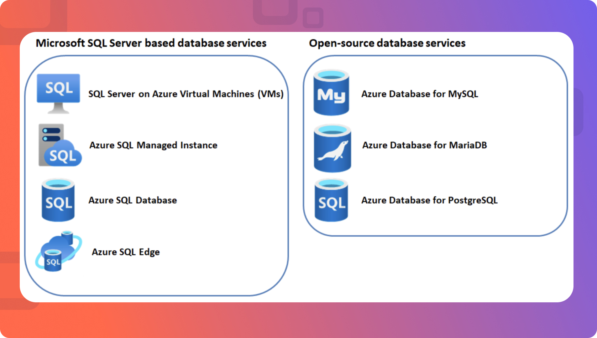

# **Module 1.6: Azure Database Services (High-Level Introduction):**

  

Azure offers a diverse range of fully managed database services, eliminating the need for you to manage the underlying infrastructure, patching, and backups. 

This allows you to focus on application development rather than database administration.

## **Azure SQL Database (PaaS Relational Database):**

**Description:** 

* Azure SQL Database is a fully managed, intelligent, relational database service built on the latest stable version of the Microsoft SQL Server database engine. 

* It's a **Platform as a Service (PaaS)** offering, meaning Microsoft handles all the underlying infrastructure, patching, backups, and monitoring.

**Purpose and Use Cases:**

* **Modern Cloud Applications:** Ideal for new cloud-native applications requiring a relational database.

* **"Lift and Shift" SQL Server Workloads:** While Azure SQL Managed Instance is often preferred for close-to-on-premises compatibility, Azure SQL Database can also be used for migrations where a managed, isolated database is sufficient.

* **Software as a Service (SaaS) Applications:** Excellent for multi-tenant applications where each tenant might have a dedicated database, or a group of databases in an elastic pool.

* **General Purpose Relational Data:** Suitable for a wide range of relational data workloads where SQL querying and ACID compliance are required.

**Key Features (PaaS Benefits):**

* **Fully Managed:** Automated backups, patching, updates, and high availability.
    
* **Scalability:** Easily scale compute and storage independently, with options like Serverless and Hyperscale tiers for extreme flexibility.
    
* **High Availability:** Built-in redundancy (up to 99.995% SLA) with automated failover.
    
* **Security:** Advanced threat protection, vulnerability assessment, transparent data encryption (TDE), and integration with Microsoft Entra ID (formerly Azure AD).

* **Intelligent Performance:** Built-in intelligence for performance optimization and automated tuning.

**Deployment Options (High-Level):**

* **Single Database:** A fully isolated database with its own set of resources.

* **Elastic Pools:** A collection of databases that share a common set of resources, ideal for multi-tenant applications with varying resource demands.

## **Azure Database for MySQL/PostgreSQL/MariaDB (PaaS Open-Source RDBMS):**

**Description:** 

* These are fully managed **PaaS** database services for popular open-source relational database engines: MySQL, PostgreSQL, and MariaDB. 

* Azure handles all the infrastructure, maintenance, security, and scaling, allowing you to focus on developing applications with your preferred open-source database.

**Purpose and Use Cases:**
    
* **Open-Source Compatibility:** For applications built on or migrating from open-source relational databases.
    
* **Web and Mobile Applications:** Common choice for content management systems (CMS), e-commerce platforms, and general web applications.
    
* **Developer Preference:** For development teams who prefer the features, community, and ecosystems of these open-source databases.
    
**Specific Features:**
        
* **PostgreSQL:** Often preferred for its advanced features, extensibility, JSON support, and strong adherence to SQL standards. Good for complex queries, geospatial data (with PostGIS), and data warehousing.
    
* **MySQL:** Widely popular for web applications (LAMP stack), simplicity, and ease of use.
    
* **MariaDB:** A community-developed fork of MySQL, offering enhanced performance, new storage engines, and often seen as a drop-in replacement for MySQL.

**Key Features (PaaS Benefits):**

* **Fully Managed:** Automated backups, patching, scaling, and high availability.

* **Flexible Scaling:** Easily scale compute and storage independently.

* **High Availability:** Built-in redundancy and automated failover.

* **Security:** Network isolation (VNet integration), encryption at rest and in transit, Microsoft Entra ID integration.

* **Cost-Effective:** Pay-as-you-go pricing, with options for reserved instances for predictable workloads.

## **Azure Cosmos DB (NoSQL Database):**

**Description:** 

* Azure Cosmos DB is a fully managed, globally distributed, multi-model database service. 

* It offers turnkey global distribution, elastic scaling of throughput and storage, and guarantees low-latency access and high availability. It's designed for mission-critical applications.

**Purpose and Use Cases:**
    
* **Globally Distributed Applications:** Ideal for applications that need to serve users worldwide with low latency reads and writes.

* **High-Performance/High-Throughput Applications:** For applications requiring predictable performance at any scale, such as IoT, gaming, retail, and mobile apps.

* **Unstructured/Semi-structured Data:** Excellent for data that doesn't fit a rigid relational schema or where the schema evolves frequently (e.g., JSON documents).

* **Multi-Model Requirements:** Supports multiple data models and APIs, allowing you to use the best fit for your application:
    
  * **NoSQL (Core) API (DocumentDB):** For JSON documents, with a SQL-like query language.
    
  * **MongoDB API:** For MongoDB applications, leveraging existing MongoDB drivers.
    
  * **Cassandra API:** For Apache Cassandra applications.
   
  * **Gremlin API:** For graph databases (nodes and edges), suitable for social networks, recommendation engines.
    
  * **Table API:** For key-value data, compatible with Azure Table Storage.

**Event Sourcing:** Its change feed functionality makes it suitable for event-driven architectures.

**Key Features:**
    
* **Global Distribution:** Replicate data across any Azure region with a single click.
    
* **Multi-Master Writes:** Enable write operations in multiple regions for highest availability and lowest write latency.
    
* **Elastic Scalability:** Independently scale throughput (Request Units/second) and storage globally.
    
* **Guaranteed Low Latency:** Backed by comprehensive SLAs for throughput, latency, availability, and consistency.

* **Multi-Model and Multi-API:** Supports various data models (document, key-value, graph, column-family) and compatible APIs.

* **Five Consistency Models:** Offers a spectrum of consistency levels (Strong, Bounded Staleness, Session, Consistent Prefix, Eventual) to balance consistency, availability, and latency.

## **Azure Cache for Redis (In-Memory Data Store)**

**Description:** 

* Azure Cache for Redis is a fully managed, in-memory data store based on the open-source Redis (Remote Dictionary Server) software. It provides a secure, dedicated Redis cache, managed by Microsoft.

**Purpose and Use Cases:**
    
* **Application Performance Improvement:** Significantly speeds up applications by storing frequently accessed data in memory, reducing the need to query slower backend databases.

* **Distributed Caching:** Caches data that is shared across multiple instances of an application or multiple applications.

* **Session Store:** Ideal for storing user session data in web applications (e.g., shopping cart contents, user preferences) for fast retrieval.

* **Leaderboards/Gaming:** Storing real-time leaderboards, game states, and player data.

* **Message Broker:** Can act as a message broker for simple publish/subscribe scenarios.

* **Data Structures:** Supports various Redis data structures like strings, hashes, lists, sets, and sorted sets.

**Key Features:**
    
* **High Throughput & Low Latency:** In-memory nature ensures very fast read and write operations.

* **Scalability:** Easily scale cache size up or out.

* **High Availability:** Options for replication and geo-replication (in Premium tier) to ensure data availability.

* **Managed Service:** Azure handles patching, updates, and maintenance.

* **Open-Source Compatibility:** Fully compatible with Redis APIs, allowing you to leverage existing Redis tools and client libraries.

---